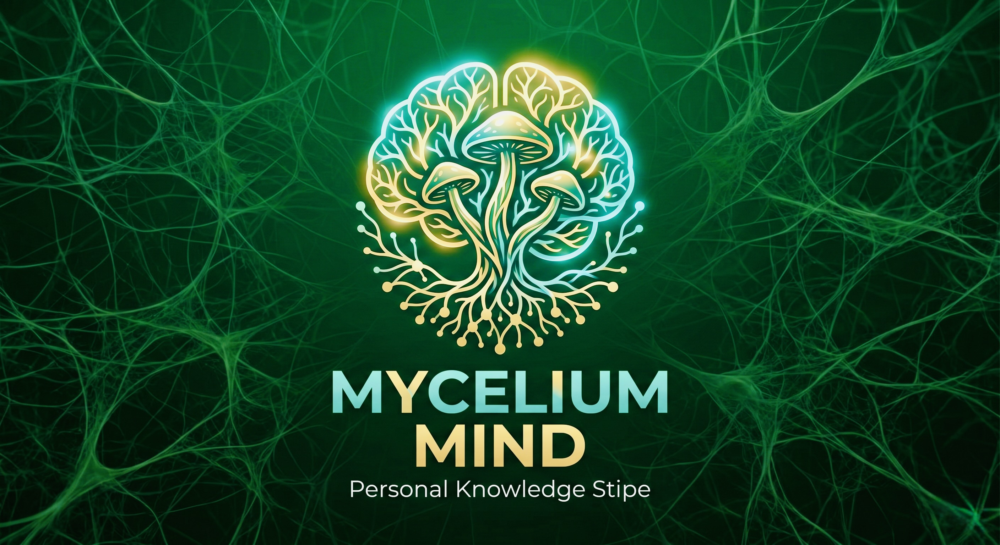
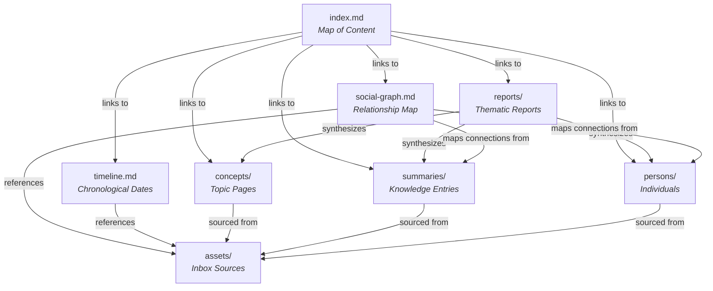
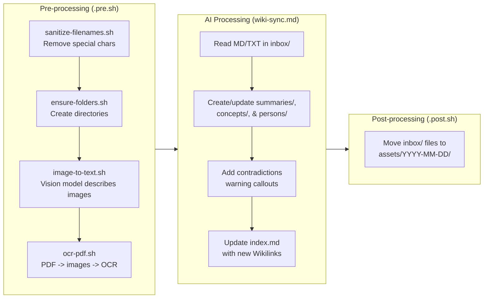

# Mycelium Mind

[](LICENSE)

Mycelium Mind is a fully offline, fully customizable, multi-vault wiki engine built on top of Obsidian, powered by local LLMs running on oMLX.

Inspired by [karpathy's llm-wiki](https://gist.github.com/karpathy/442a6bf555914893e9891c11519de94f).

Implemented using [Google Antigravity](https://antigravity.google/) and VS Code.  

The offline engine is powered by [OpenCode](https://opencode.ai/), [oMLX](https://omlx.ai/) and [Qwen3.6-35B-A3B-UD-MLX-4bit](https://huggingface.co/unsloth/Qwen3.6-35B-A3B-UD-MLX-4bit).



---

## 1. Prerequisites & Quick Start

Get your fully offline knowledge base up and running in minutes.

### Sequential Setup Guide (Follow In Order)

To ensure a seamless setup, install and configure the required tools in this exact sequence:

1. **Step 1: Install Obsidian (Your UI)**
   - Mycelium Mind compiles your files into standard Markdown vaults optimized for [Obsidian](https://obsidian.md/).
   - **Action:** Download and install [Obsidian](https://obsidian.md/) on your local machine to view, search, and navigate your wiki.

2. **Step 2: Install System Dependencies (CLI Tools)**
   - Mycelium Mind requires `jq` (JSON command-line parser) and `poppler` (PDF rendering utilities).
   - **Action:** Open your terminal in the repository root and run the following command to install them via Homebrew:
     ```bash
     brew bundle install
     ```

3. **Step 3: Install oMLX & Download Local Models (The AI Brain)**
   - Mycelium Mind runs **100% offline** on your machine using local models.
   - **Action:**
     - Download and install [oMLX](https://omlx.ai/) (local model runner).
     - Pull the designated models to your machine:
       - **Text Model:** `Qwen3.6-35B` (Main LLM)
       - **Vision Model:** `Gemma-4-31B-IT` (For image descriptions)
       - **OCR Model:** `DeepSeek-OCR-2-bf16` (For extracting text from PDFs)
     - Start the local server to expose the completions API endpoint.

4. **Step 4: Install OpenCode (The Orchestrator)**
   - Mycelium Mind runs inside [OpenCode](https://opencode.ai/), which handles executing the modular slash-commands and lifecycle plugins found in `.opencode/`.
   - **Action:** Download and install [OpenCode](https://opencode.ai/).

5. **Step 5: Configure the Environment & OpenCode Models**
   - **Action A: Configure root `.env`:** Create a `.env` file at the repository root to link your local sub-models:
     ```env
     # Local oMLX / OpenAI-compatible endpoint
     API_URL="http://localhost:8000/v1/chat/completions"
     API_KEY="your-api-key"
     
     # Model configuration for OCR and Vision
     OCR_MODEL_NAME="DeepSeek-OCR-2-bf16"
     IMAGE_MODEL_NAME="gemma-4-31b-it-4bit"
     ```
   - **Action B: Configure OpenCode Main Model (`.opencode/models.yaml`):** OpenCode orchestrates commands using the primary Qwen text model. Create or update `.opencode/models.yaml` inside the `.opencode/` folder to target your local server:
     ```yaml
     # .opencode/models.yaml
     default:
       api_url: "http://localhost:8000/v1"
       api_key: "your-api-key"
       model: "Qwen3.6-35B-A3B-UD-MLX-4bit"
     ```

---

### Ingestion Guide

To initialize a brand new, empty personal vault and begin ingesting your documents:

1. **Create Vault Structure:** Initialize your inbox and wiki folders (replace `<VaultName>` with your desired name, e.g., `Me`):
   ```bash
   mkdir -p Vaults/<VaultName>/inbox Vaults/<VaultName>/wiki
   ```
2. **Drop Raw Files:** Place raw documents, research papers (PDFs), diagrams (PNG/JPG), or meeting notes (TXT/MD) in the `Vaults/<VaultName>/inbox/` folder.
3. **Execute Ingestion:** Open your terminal in the workspace root, open `opencode` and run the master orchestrator command:
   ```bash
   /wiki <VaultName>
   ```
4. **Explore in Obsidian:** Open the compiled `Vaults/<VaultName>/wiki` folder inside Obsidian to browse, search, and view your visual network graph!

> [!TIP]
> **Testing with the Example Wiki:** The repository comes pre-bundled with an example vault named `LLM-Wiki` under `Vaults/LLM-Wiki/`. You can use it to test the pipeline immediately without manual folder setup by dropping raw files into `Vaults/LLM-Wiki/inbox/` and running `/wiki LLM-Wiki`.

## 2. Architecture & Directory Structure

Mycelium Mind operates on a decoupled multi-vault architecture. Here is the repository and compiled vault layout:

```
.opencode/
  ├── commands/               <- Slash-commands (independent, modular AI instructions)
  │   ├── wiki.md                 <- Master pipeline orchestration
  │   ├── wiki.commands.json      <- Orchestration chain (sync -> timeline -> social-graph)
  │   ├── wiki.pre.sh             <- Orchestration helper script
  │   ├── wiki-sync.md            <- Main ingestion prompt
  │   ├── wiki-sync.commands.json <- Ingestion dependencies (lint first)
  │   ├── wiki-sync.pre.sh        <- OCR, Vision parser runner
  │   ├── wiki-sync.post.sh       <- Moves inbox sources to assets folder
  │   ├── wiki-sync/              <- Shell sub-scripts for OCR and sanitization
  │   │   ├── ensure-folders.sh       <- Ensures Vault directories exist
  │   │   ├── image-to-text.sh        <- Vision model runner for images
  │   │   ├── ocr-pdf.sh              <- PDF to images and OCR runner
  │   │   └── sanitize-filenames.sh   <- Inbox filename cleanup utility
  │   ├── wiki-diff.md            <- Git diff integration command
  │   ├── wiki-diff.commands.json <- Hook chain configuration (runs wiki-lint post-hook)
  │   ├── wiki-diff.pre.sh        <- Parameter checker script
  │   ├── wiki-lint.md            <- Linter command
  │   ├── wiki-lint.pre.sh        <- Linter parameter checker
  │   ├── wiki-timeline.md        <- Timeline generation command
  │   ├── wiki-timeline.pre.sh    <- Timeline parameter checker
  │   ├── wiki-social-graph.md    <- Social graph generation command
  │   ├── wiki-social-graph.pre.sh <- Social graph parameter checker
  │   ├── wiki-report.md          <- Cross-vault report generator
  │   └── wiki-report.pre.sh      <- Report folder verification script
  ├── skills/                 <- Auto-triggered skills
  │   └── wiki-qa/
  │       └── SKILL.md                <- Contextual RAG Q&A
  ├── opencode.json           <- Local OpenCode settings & plugins declaration
  ├── package.json            <- Node package definitions
  └── package-lock.json       <- Fixed dependency tree
opencode.json                 <- Project root OpenCode plugins config
Vaults/                       <- Multi-Vault Management
  ├── LLM-Wiki/                 <- Pre-bundled example vault (Zero-config Quick Start)
  │   ├── inbox/                    <- Drop raw files here to ingest
  │   └── wiki/                     <- Target Obsidian vault destination
  └── <CustomVault>/            <- Any other custom vaults you create
```

Inside each `wiki/` destination, the compiled knowledge base follows a strict structural schema:
- `index.md`: Map of Content (Main Directory / Entry Point).
- `timeline.md`: Master chronological timeline.
- `social-graph.md`: Visual network map and relationship table.
- `concepts/`: Topic, tool, and entity detail pages.
- `persons/`: Biographies, affiliations, and relationships.
- `summaries/`: Sourced knowledge synthesis cards.
- `reports/`: Cross-vault thematic or Map of Content reports.
- `assets/`: Structured archive of raw source files organized by date.

### Vault Data Relations

The following diagram illustrates how the compiled pages in an Obsidian Vault inter-link and reference one another:



---

## 3. Central Orchestration & Execution Flow

Mycelium Mind is fully driven by a **decoupled, modular slash-command architecture**. The central orchestrator is `/wiki`:

```bash
/wiki <VaultName>
```

When you trigger `/wiki <VaultName>`, it doesn't run a single monolithic script. Instead, it acts as a central director, triggering a modular sequence of highly targeted, single-responsibility sub-commands in a strict sequential order through automated **Pre-Hooks** and **Post-Hooks**.

### Sequential Pipeline Sequence

The sequence diagram below details the exact chronological execution path from the moment you run the `/wiki` command:

```mermaid
sequenceDiagram
    autonumber
    actor User as "User in OpenCode"
    participant WikiCmd as "/wiki Command"
    participant PreHook as "Pre-Hook (wiki.pre.sh)"
    participant PostHook as "Post-Hook Orchestration"
    participant LintCmd as "/wiki-lint Command"
    participant SyncCmd as "/wiki-sync Command"
    participant SyncPre as "Pre-Hook (wiki-sync.pre.sh)"
    participant SyncPost as "Post-Hook (wiki-sync.post.sh)"
    participant TimelineCmd as "/wiki-timeline Command"
    participant SocialCmd as "/wiki-social-graph Command"

    User->>WikiCmd: Run /wiki <VaultName>
    rect rgb(30, 41, 59)
        note right of WikiCmd: Master Orchestration Phase
        WikiCmd->>PreHook: Execute pre-hook
        PreHook-->>WikiCmd: Print planned execution sequence
        WikiCmd-->>User: Inform that vault will be updated
    end

    rect rgb(15, 23, 42)
        note right of PostHook: Chain Execution (via wiki.commands.json)
        
        Note over LintCmd, SyncCmd: Step A: wiki-sync (Pre-hooked with wiki-lint)
        PostHook->>SyncCmd: Trigger wiki-sync
        SyncCmd->>LintCmd: Trigger pre-hook wiki-lint
        LintCmd-->>SyncCmd: Scan & auto-repair wikilink structure
        SyncCmd->>SyncPre: Run pre-processing (sanitization, OCR, Vision)
        SyncPre-->>SyncCmd: Extracted markdown & descriptions
        SyncCmd->>SyncCmd: Main AI synthesis & entry writing
        SyncCmd->>SyncPost: Run post-processing
        SyncPost-->>SyncCmd: Move inbox files to assets/YYYY-MM-DD
        SyncCmd-->>PostHook: Sync completed
        
        Note over TimelineCmd: Step B: wiki-timeline
        PostHook->>TimelineCmd: Trigger wiki-timeline
        TimelineCmd->>TimelineCmd: Extract dates & generate timeline.md
        TimelineCmd-->>PostHook: Timeline completed

        Note over SocialCmd: Step C: wiki-social-graph
        PostHook->>SocialCmd: Trigger wiki-social-graph
        SocialCmd->>SocialCmd: Map connections & generate social-graph.md
        SocialCmd-->>PostHook: Social Graph completed
    end
    
    PostHook-->>User: Pipeline execution finished!
```



---

## 4. The Command Pipeline & Tooling

Each subcommand in the Mycelium Mind system is completely autonomous and can be run independently using its own slash-command:

| Command | File | Description | Target Outputs |
| :--- | :--- | :--- | :--- |
| **`/wiki <VaultName>`** | `commands/wiki.md` | **Central Pipeline Orchestration**<br>Triggers the complete automated pipeline sequentially (lint, sync, timeline, and social graph compilation). | All vault files |
| **`/wiki-sync <VaultName>`** | `commands/wiki-sync.md` | **Core Ingestion & Synthesis**<br>Performs OCR, Vision descriptions of images, creates/updates files under `summaries/`, `concepts/`, and `persons/`, and logs sources to `assets/`. | `wiki/summaries/`<br>`wiki/concepts/`<br>`wiki/persons/`<br>`wiki/assets/` |
| **`/wiki-diff <VaultName>`** | `commands/wiki-diff.md` | **Git Diff Integration**<br>Checks the current git diff filtered to the vault directory (`Vaults/<VaultName>/`), processes recent changes since the last commit, and integrates them. Runs `/wiki-lint`, `/wiki-timeline`, and `/wiki-social-graph` as post-hooks. | `wiki/summaries/`<br>`wiki/concepts/`<br>`wiki/persons/` |
| **`/wiki-lint <VaultName>`** | `commands/wiki-lint.md` | **Wiki Health Check & Auto-Repair**<br>Scans for broken wikilinks, orphaned pages, stale entries, or stubs. Asks before applying fixes. | Interactive report |
| **`/wiki-timeline <VaultName>`** | `commands/wiki-timeline.md` | **Chronological Timeline Synthesis**<br>Scans all summaries, concepts, and biography pages, extracts all dates/events, sorts them chronologically. | `wiki/timeline.md` |
| **`/wiki-social-graph <VaultName>`** | `commands/wiki-social-graph.md` | **Social Graph & Connection Map**<br>Extracts relationships (advisor, coworker, collaborator, etc.) to compile an interactive Mermaid diagram. | `wiki/social-graph.md` |
| **`/wiki-report <Vaults> <Query>`** | `commands/wiki-report.md` | **Thematic Cross-Vault Synthesis**<br>Discovers and synthesizes information across one or more separate vaults to write a themed report. | `wiki/reports/` |

### Implicit Context Skills

For conversational interaction with the vault, Mycelium Mind uses **Wiki Q&A**:
- **File:** `.opencode/skills/wiki-qa/SKILL.md`
- **Trigger:** Activates automatically when you ask a question about your wiki's knowledge. It performs retrieval-augmented search (RAG) and answers you using native Obsidian `[[Wikilinks]]` to cite sources.

---

## 5. Deep Dive: Ingestion Pipeline (`/wiki-sync`)

While the central orchestrator is `/wiki`, the heaviest lifting of file ingestion is done by `/wiki-sync`. It runs a three-phase pipeline:



1. **Pre-processing (`wiki-sync.pre.sh`):**
   - **`sanitize-filenames.sh`**: Strips illegal character formatting and spaces from raw inbox filenames.
   - **`ensure-folders.sh`**: Instantiates a fresh vault structure if none exists.
   - **`image-to-text.sh`**: Captures JPG/PNG files and instructs the local Gemma Vision model to generate granular descriptive summaries.
   - **`ocr-pdf.sh`**: Utilizes `pdftoppm` to extract PDF pages as images and processes them via the local DeepSeek OCR model to output exact text documents.
2. **AI Processing (`wiki-sync.md`):**
   - The primary text LLM (`Qwen3.6-35B`) processes all inputs.
   - Generates or appends incremental details to concepts, biographies, and knowledge cards.
   - Flags overlapping/contradictory statements across different source files using native Obsidian warnings: `> [!warning] Contradiction Detected`.
   - Populates `index.md` automatically, integrating new entries with native `[[Wikilinks]]`.
3. **Post-processing (`wiki-sync.post.sh`):**
   - Takes all successfully processed files in the `inbox/` directory and archives them under `wiki/assets/YYYY-MM-DD/` to preserve a clean inbox state.

---

## 6. Automation Hooks & Declarative Modularity

Mycelium Mind utilizes the **Command Hooks** plugin (`@pkcpkc/opencode-plugin-command-hooks`) to orchestrate complex execution chains. This plugin is loaded declaratively via `opencode.json` in the project root:

```json
{
  "$schema": "https://opencode.ai/config.json",
  "plugin": [
    "@pkcpkc/opencode-plugin-command-hooks@^0.3.0"
  ]
}
```

This setup enables fully automated shell execution points:
- **Pre-hooks (`<command>.pre.sh`):** Runs prior to the primary AI command prompt execution (e.g. running OCR parsing).
- **Post-hooks (`<command>.post.sh`):** Fires upon successful AI execution (e.g. moving processed files to archives).

### Chain-Executing via Declarative JSON (`*.commands.json`)

You can chain-execute commands modularly. Whenever a command `<name>` is run, the hooks plugin checks for `<name>.commands.json` at `.opencode/commands/` and executes the designated lists:

- **`wiki.commands.json` (Orchestration Chain):**
  ```json
  {
    "pre": [],
    "post": [
      "wiki-sync $1",
      "wiki-timeline $1",
      "wiki-social-graph $1"
    ]
  }
  ```
- **`wiki-sync.commands.json` (Ingestion Chain):**
  ```json
  {
    "pre": [
      "wiki-lint $1"
    ],
    "post": []
  }
  ```
- **`wiki-diff.commands.json` (Diff Ingestion Chain):**
  ```json
  {
    "pre": [],
    "post": [
      "wiki-lint $1",
      "wiki-timeline $1",
      "wiki-social-graph $1"
    ]
  }
  ```

---

## 7. Extending with Custom Commands

Because commands are completely modular, you can easily create and register your own custom AI commands to generate specialized pages!

### Step A: Define your command prompt (`<command-name>.md`)

Create a new file in `.opencode/commands/wiki-custom-page.md` to instruct the AI:

```markdown
---
description: Generates a custom analysis page for a specific vault. Usage: /wiki-custom-page <VaultName>
---

# Wiki Custom Page Command

## Current Vault Context
Vault: `../../Vaults/$1`

## Execution Instructions
When this command is triggered:
1. Scan the `../../Vaults/$1/wiki/concepts/` directory.
2. Synthesize a comprehensive glossary / cheatsheet page.
3. Save the result to `../../Vaults/$1/wiki/custom-glossary.md`.
```

### Step B: Add Shell Hooks (Optional)

If your command needs shell scripts (e.g. database updates, API fetching), add:
- `.opencode/commands/wiki-custom-page.pre.sh`
- `.opencode/commands/wiki-custom-page.post.sh`

### Step C: Register in `wiki.commands.json`

To make your custom command run automatically as part of the master `/wiki` orchestrator, add it to the `"post"` array of `wiki.commands.json`:

```json
{
  "pre": [],
  "post": [
    "wiki-sync $1",
    "wiki-timeline $1",
    "wiki-social-graph $1",
    "wiki-custom-page $1"
  ]
}
```

---

## 8. Models & Tools Reference

All models and tools run **fully offline** on your local machine:

### Brain Models (oMLX Hosted)
- **Qwen3.6-35B-A3B-UD-MLX-4bit:** Main LLM for text synthesis, pipeline compilation, Q&A skills, and linter checks.
- **Gemma-4-31B-IT:** Vision model for descriptive annotation of diagram and photo assets.
- **DeepSeek-OCR-2-bf16:** Dedicated optical character recognition engine for PDF and document image text extraction.

### Core CLI Tooling
- **[oMLX](https://omlx.ai/):** Local hardware-accelerated model running server.
- **[OpenCode](https://opencode.ai/):** Declarative AI coding engine and command environment.
- **[poppler](https://poppler.freedesktop.org/):** System rendering utilities (`pdftoppm`) for compiling PDF files into high-fidelity image pages.
- **[jq](https://jqlang.github.io/jq/):** JSON command-line parser.
- **[Obsidian](https://obsidian.md/):** Frontend UI and graph renderer (Required to explore, search, and visually navigate your wiki).

---

## Acknowledgements

Thanks for inspiration to [Paul Hackenberger](https://www.linkedin.com/in/paul-hackenberger/), [Dan-Yoel Bittner](https://www.linkedin.com/in/dan-yoel-bitter-617a74157/), and [Rainer Kruschwitz](https://www.linkedin.com/in/kruschwitz/).
