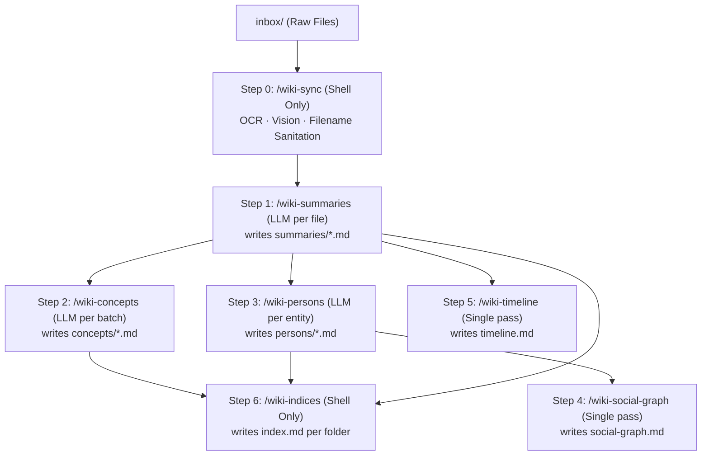

# Mycelium Mind

Mycelium Mind is a fully offline, multi-vault wiki engine built on top of Obsidian, powered by local LLMs running on oMLX.

Inspired by [karpathy's llm-wiki](https://gist.github.com/karpathy/442a6bf555914893e9891c11519de94f) and orchestrated via [OpenCode](https://opencode.ai/).

---

## 📜 [Offline Knowledge Format (OKF)](https://github.com/GoogleCloudPlatform/knowledge-catalog/tree/main/okf) Standard

Mycelium Mind strictly conforms to the [**Offline Knowledge Format (OKF)**](https://github.com/GoogleCloudPlatform/knowledge-catalog/tree/main/okf) standard. OKF is a strict schema specification for offline Obsidian-based wikis designed to maximize readability and interoperability for both human readers and AI models (via MCP).

Under the OKF standard:
1. **Frontmatter Conformance**: Every knowledge card (except root indices) must contain parseable YAML frontmatter declaring its logical `type`, `title`, `description`, and a UTC ISO-8601 `timestamp`.
2. **Standard Schemas**: Vault assets are structured into five core directories, each governed by its own schema definition:
   - `schemas/summary.md`: governs `summaries/` (dense synthesis cards linking to source assets with an extracted entity manifest).
   - `schemas/concept.md`: governs `concepts/` (definitions, key details, and relations for abstract ideas/methodologies).
   - `schemas/person.md`: governs `persons/` (structured biographies and collaborator networks for individuals).
   - `schemas/report.md`: governs `reports/` (cross-vault thematic synthesis pages).
3. **Flat Wikilinks**: All links between files use standard flat Obsidian wikilinks without path prefixes (e.g., `[[Andrej Karpathy]]`, not `[[persons/Andrej Karpathy]]`), allowing the graph to remain fully relocatable.
4. **Separation of Concerns**: Persons reside exclusively under `persons/`, concepts under `concepts/`, and summaries under `summaries/`. No duplicate names should overlap across directories.

---

## 🧠 Design Principles

1. **Filesystem is the interface.** Each command reads from and writes to well-defined directories. No shared state, no session context.
2. **Every command runs standalone.** `/wiki-persons LLM-Wiki` works without `/wiki` having run. If its input directory (`summaries/`) has files, it runs. If not, it exits cleanly.
3. **Isolated LLM contexts.** Commands that process multiple entities delegate to a shell loop script that spawns `opencode run --command <child> <args>` per entity. The parent command never holds all entities in context simultaneously.
4. **Schema injection via `!cat`.** Each child command prompt includes the relevant schema file so the local 35B model has the exact template in its context.
5. **Hybrid metadata.** The LLM generates semantic fields (`type`, `title`, `description`, `tags`, `entities`). Shell scripts inject system fields (`resource`, `timestamp`) programmatically.

---

## 🗺️ Pipeline Dependency Graph

The entire ingestion and synthesis pipeline is organized as a decoupled DAG (Directed Acyclic Graph) of standalone OpenCode commands:



---

## 🚀 Quick Start (Offline Ingestion)

Follow this sequence to ingest your files into a clean Obsidian wiki vault:

### 1. Prerequisites
Install **Obsidian**, and fetch the CLI tools:
```bash
brew bundle install
gh auth login
```

### 2. Configure Local Models (oMLX)
Start your local oMLX server hosting the following models:
* **Text:** `Qwen3.6-35B`
* **Vision:** `Gemma-4-31B-IT` (image analysis)
* **OCR:** `DeepSeek-OCR-2-bf16` (PDF extraction)

Create a `.env` in the repository root:
```env
API_URL="http://localhost:8000/v1/chat/completions"
API_KEY="your-api-key"
OCR_MODEL_NAME="DeepSeek-OCR-2-bf16"
IMAGE_MODEL_NAME="gemma-4-31b-it-4bit"
```

Configure OpenCode's main text model in `.opencode/models.yaml`:
```yaml
default:
  api_url: "http://localhost:8000/v1"
  api_key: "your-api-key"
  model: "Qwen3.6-35B-A3B-UD-MLX-4bit"
```

### 3. Drop & Process Files
1. Create your vault folder structure:
   ```bash
   mkdir -p Vaults/LLM-Wiki/inbox Vaults/LLM-Wiki/wiki
   ```
2. Place raw PDFs, images, text, or markdown files into `Vaults/LLM-Wiki/inbox/`.
3. In your OpenCode terminal, run the orchestrator:
   ```bash
   /wiki LLM-Wiki
   ```
4. Open the compiled `Vaults/LLM-Wiki/wiki/` folder in **Obsidian** to view your synced wiki!

---

## 📂 Vault Schema & Directory Map

Inside your vault root `Vaults/<VaultName>/`, Mycelium Mind organizes files into configuration/input folders and the compiled Obsidian-facing `wiki/` directory:

* `schemas/` — OKF schema definitions for all content types (kept outside `wiki/` to avoid spoiling Obsidian).
* `inbox/` — Input area for raw documents.
* `wiki/` — The compiled Obsidian vault (open this folder in Obsidian!):
  * `index.md` — The Map of Content (entry directory).
  * `summaries/` — Synthesis cards for raw documents.
  * `concepts/` — General concept and topic notes.
  * `persons/` — Biography cards for individuals.
  * `reports/` — Cross-vault thematic syntheses (compiled via `/wiki-report`).
  * `assets/` — Archive of raw documents sorted by date of ingestion (`assets/YYYY-MM-DD/`).

---

## 🧩 Commands Reference & Contract Table

All subcommands run independently in OpenCode:

| Command | Reads | Writes | LLM Invocations | Standalone? | Description |
| :--- | :--- | :--- | :--- | :--- | :--- |
| `/wiki-sync` | `inbox/` (binary + text) | `inbox/` (converted text) | None (pure shell) | ✅ | Pre-processes inbox files (OCR, vision, filename sanitation). |
| `/wiki-summaries` | `inbox/*.md,*.txt` | `summaries/`, `assets/` | 1 per inbox file | ✅ | Generates OKF Summary cards from inbox files. |
| `/wiki-concepts` | `summaries/` (frontmatter) | `concepts/` | 1 per batch of ~5 | ✅ | Extracts and generates Concept cards from summaries. |
| `/wiki-persons` | `summaries/` (frontmatter) | `persons/` | 1 per person entity | ✅ | Extracts and generates Person biography cards from summaries. |
| `/wiki-social-graph` | `persons/` | `social-graph.md` | 1 (single pass) | ✅ | Generates a Mermaid social graph and connection map of persons. |
| `/wiki-timeline` | `summaries/` | `timeline.md` | 1 (single pass) | ✅ | Compiles a chronological timeline of events from summaries. |
| `/wiki-indices` | `wiki/*` (frontmatter) | `* /index.md` | None (pure shell) | ✅ | Generates OKF folder-level index.md files for progressive disclosure. |
| `/wiki-lint` | `wiki/*` + `schemas/*` | stdout (report) | 1 (single pass) | ✅ | Performs a health check and OKF compliance audit on the wiki. |
| `/wiki-report` | `summaries/`, `concepts/` | `reports/` | 1 (single pass) | ✅ | Synthesizes a thematic study across multiple vaults. |
| `/wiki` | — | — | Orchestrates all above | ✅ | Runs the entire pipeline sequentially. |

---

## 🔗 Hook-Based Modularity & Pipeline Extension

Mycelium Mind is designed around **single-responsibility, decoupled commands** that build on top of each other. This is orchestrated via the Command Hooks plugin (`@pkcpkc/opencode-plugin-command-hooks`), which executes sequential shell scripts and OpenCode commands before and after a main command executes.

Because commands are completely modular, you can easily extend the ingestion pipeline with new LLM-driven features (e.g. generating custom category indices, extracting semantic structures, or running concept-specific syntheses).

### Case Study: Adding a `/wiki-companies` Command
Suppose we want to automatically scan all ingested text, identify mentioned companies, and compile a dedicated profile page for each under `wiki/companies/`.

#### Step A: Define the Company Schema (`Vaults/LLM-Wiki/schemas/company.md`)
First, define the structured metadata and layout template for Company profile cards:

```yaml
---
type: "Schema"
title: "Company Schema"
description: "Defines the required metadata fields and structural format for company profile pages."
---
```

Body:
```markdown
# Company Schema

Company profiles are structured cards representing organizations, institutions, or corporate entities.

## Frontmatter Specification

| Key           | Type     | Requirement    | Description                                              |
|:--------------|:---------|:---------------|:---------------------------------------------------------|
| `type`        | String   | **Required**   | Must be exactly `"Company"`.                             |
| `title`       | String   | **Required**   | Full name of the company.                                |
| `description` | String   | Recommended    | A single sentence description of what the company does.  |
| `tags`        | Array    | Optional       | Category tags (e.g., `["artificial-intelligence"]`).      |
| `timestamp`   | String   | **Required**   | ISO-8601 UTC datetime of last modification.              |

## Markdown Body Structure

- **`# [Company Name]`** — L1 main title.
- **`## Overview`** — Summary description of the company.
- **`## Founders & Leadership`** — Bulleted list of founders (using Obsidian wikilinks).
- **`## Products & Technologies`** — Key products or systems developed.
- **`## Context & Operations`** — Narrative history synthesized from mentions in summaries.

## Template

    ---
    type: "Company"
    title: "${title}"
    description: "${description}"
    tags: ${tags}
    timestamp: "${timestamp}"
    ---
    # ${title}

    ## Overview

    [High-level description...]

    ## Founders & Leadership

    - [[Founder A]]
    - [[Founder B]]

    ## Products & Technologies

    - [Product A]

    ## Context & Operations

    [Detailed context...]
```

#### Step B: Define the Command Prompt (`.opencode/commands/wiki-companies.md`)
Create a prompt instructing the LLM on how to extract and format company pages, injecting the newly defined schema:

```markdown
---
description: Scans summaries and concepts to identify companies and compile profile pages under companies/. Usage: /wiki-companies <VaultName>
---
# Wiki Companies Command

## Context
Vault Name: $1

## Company Schema

!`cat ./Vaults/$1/schemas/company.md`

## Instructions
1. Scan `./Vaults/$1/wiki/summaries/` and `./Vaults/$1/wiki/concepts/`.
2. Extract all mentioned business entities or companies.
3. For each unique company, write or update `./Vaults/$1/wiki/companies/[Company Name].md` conforming to the Company Schema template EXACTLY.
4. Set the `timestamp` field to the current date/time in ISO-8601 UTC format.
```

#### Step C: Declare Hooks (`.opencode/commands/wiki-companies.hooks.json`)
Configure the pre-script to ensure the target directory exists:
```json
{
  "scripts": {
    "pre": [
      "mkdir -p ./Vaults/$1/wiki/companies"
    ]
  }
}
```

#### Step D: Append to the Master Pipeline (`.opencode/commands/wiki.hooks.json`)
To make this new company extraction execute automatically whenever you run `/wiki <VaultName>`, simply append it to the post-commands array in the master hooks file:
```json
{
  "commands": {
    "post": [
      "wiki-sync $1",
      "wiki-summaries $1",
      "wiki-concepts $1",
      "wiki-persons $1",
      "wiki-companies $1",
      "wiki-social-graph $1",
      "wiki-timeline $1"
    ]
  }
}
```

---

## 🔌 Model Context Protocol (MCP) Integration

Mycelium Mind exposes your vaults programmatically to other LLM interfaces (Claude Desktop, Cursor, Cline, Roo Code) via MCP. 

Register the server by adding this to your MCP configuration (`mcp_config.json`):

```json
{
  "mcpServers": {
    "mycelium-mind": {
      "command": "node",
      "args": [
        "/Users/pkc/Projects/mycelium-mind/mcp/build/index.js",
        "--vault=LLM-Wiki"
      ],
      "cwd": "/Users/pkc/Projects/mycelium-mind/mcp"
    }
  }
}
```

*Note: Omit `--vault=<name>` to run in **Multi-Vault Mode**, which activates vault discovery (`get_vaults`) and exposes all vaults under `Vaults/`.*
For detailed configuration and API tool schemas, see the [MCP README](file:///Users/pkc/Projects/mycelium-mind/mcp/README.md).
