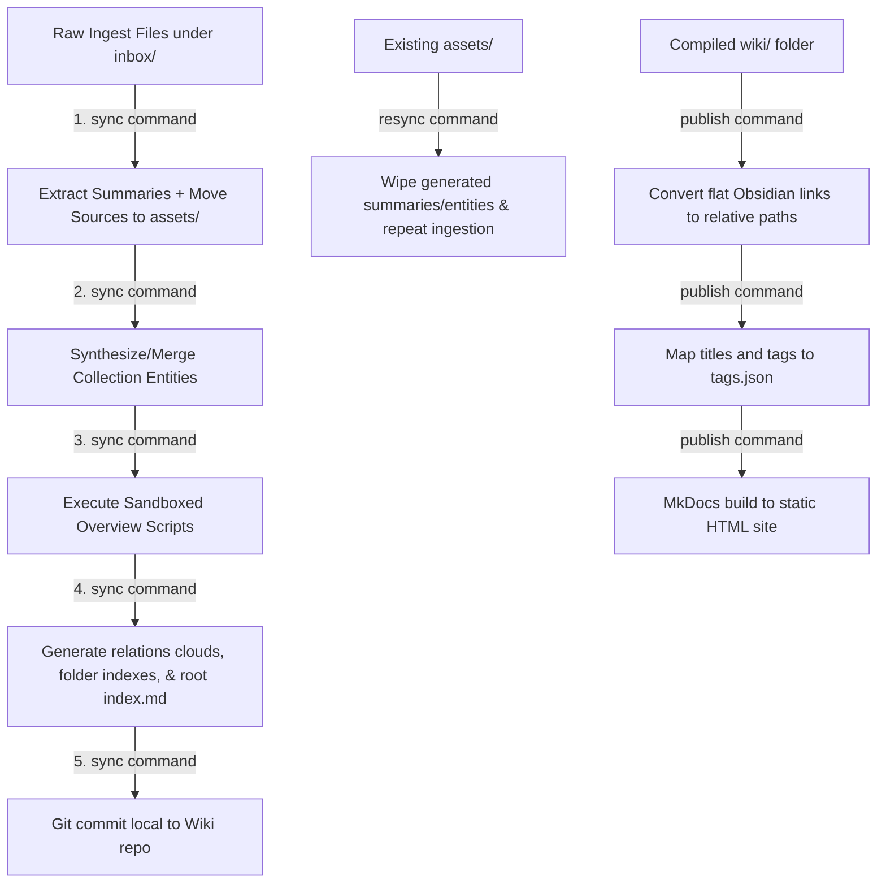
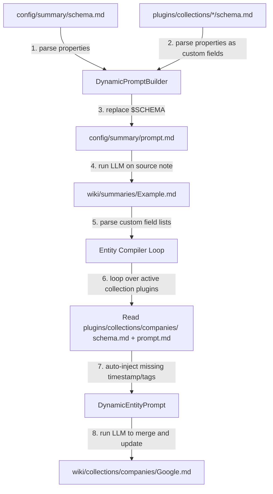

# Mycelium Mind 🧠

Mycelium Mind is a fully offline, schema-driven, multi-vault compiler pipeline and wiki engine built on top of **Obsidian** and **MkDocs**, powered by local LLMs via an OpenAI-compatible API.

It is designed to ingest raw documents, synthesize them into structured metadata-rich cards (conforming to the **Open Knowledge Format (OKF)** standard), dynamically construct interactive relationships between concepts, and compile them into static, publishable documentation sites.

---

## 🧠 Design & Core Principles

1. **Local & Offline First**: Designed to run entirely on your local machine using local LLMs (e.g. via oMLX, llama.cpp, Ollama, or LM Studio) through standard OpenAI-compatible API endpoints.
2. **Strict Schema Validation & Auto-Injection**: Vault entities are governed by markdown-defined schema specifications. Common system metadata such as `timestamp` and `tags` are automatically injected into the schema definitions and processed frontmatter at compile-time to reduce LLM prompt size and guarantee schema consistency.
3. **Isolated LLM Invocations**: To prevent context window overflow, each raw inbox document is processed individually. Entity syntheses are batched and compiled incrementally to scale to large vaults.
4. **Git-Backed Version Control**: The compiler performs local git commits and tags directly inside the directory of each target wiki, ensuring clean revision history local to the vault itself.
5. **Decoupled Architecture**: Each CLI command operates independently. Folder structures are dynamically inspected, allowing you to easily add new schemas, collections, or custom overview scripts.

---

## 🛠️ Environment & Runtime Manager

This repository uses [mise](https://mise.jdx.dev/) to ensure fully reproducible runtimes for Node.js and Python.

- **Node.js Version**: `25.9.0`
- **Python Version**: `3.11.15`
- **Virtual Environment**: `.venv/` containing python dependencies (e.g., `headroom-ai` for visualization/hosting).

To execute commands within the correct environment context:

```bash
# Run CLI commands using the pinned Node version
mise exec -- npm run cli <command> <wiki-path>

# Run python scripts or tools from the venv
mise exec -- python script.py
```

---

## 📂 Vault Structure & Directory Map

When a vault is initialized, it is structured to cleanly separate source inputs, pipeline configurations, compiled pages, and published web outputs:

```
Vaults/<WikiName>/
├── inbox/                        # Input folder for raw PDFs, images, markdown, or text files
├── config/
│   ├── mkdocs.yml                # Configuration file for MkDocs static site generation
│   └── summary/
│       ├── prompt.md             # LLM Prompt for document summary extraction
│       └── schema.md             # Frontmatter schema specification for summaries
├── plugins/
│   ├── collections/              # Custom collections defined by prompt and schema
│   │   ├── concepts/
│   │   ├── persons/
│   │   └── times/
│   └── overviews/                # Sandboxed JavaScript scripts to generate structural overview pages
│       ├── social-graph.js
│       └── timeline.js
└── wiki/                         # The compiled Obsidian Vault (Open this folder in Obsidian!)
    ├── index.md                  # Map of Content (auto-rebuilt index of the entire vault)
    ├── assets/                   # Archive of raw ingested files (sorted by YYYY-MM-DD date)
    ├── summaries/                # Compiled summary cards of source assets
    ├── collections/              # Compiled entity collections (e.g. concepts/, persons/, times/)
    │   ├── concepts/
    │   │   ├── index.md          # Concept index linking all concept cards
    │   │   ├── concepts-cloud.md # Interactive relation cloud matching shared tags
    │   │   └── ...
    │   ├── persons/
    │   └── times/
    └── overviews/                # Generated structural overviews (e.g. timeline.md, social-graph.md)
```

---

## 🗺️ Pipeline Architecture

The overall execution pipeline is split into separate phases:



---

## 🚀 Quick Start Guide

### 1. Prerequisites & Installation

Clone the repository and install the dependencies:

```bash
# Clone the repository
git clone https://github.com/pkcpkc/mycelium-mind.git
cd mycelium-mind

# Install Node & Python runtimes via mise
mise install

# Install project dependencies
npm install
```

### 2. Configure Your Local Model Endpoint

Create a `.env` file in the root of the repository:

```env
API_URL="http://localhost:8000/v1"
API_KEY="your-api-key"
AGENTIC_MODEL_NAME="your-local-llm-model-name"
```

### 3. Initialize a Wiki Vault

Initialize a new vault structure in your chosen directory:

```bash
mise exec -- npm run cli init ./my-first-wiki
```

> [!NOTE]
> This command populates folder structures, base prompts, default collection schemas (concepts, persons, times), and initializes a local git repository inside the vault folder.

### 4. Sync the Inbox

Drop some raw text files or articles into `./my-first-wiki/inbox/`, then trigger the compiler sync:

```bash
mise exec -- npm run cli sync ./my-first-wiki
```

This runs the main ingestion pipeline:

1. Summarizes inbox documents into `wiki/summaries/`.
2. Archives raw sources into dated directories inside `wiki/assets/`.
3. Batches and synthesizes entity cards inside `wiki/collections/`.
4. Runs sandboxed overview scripts to compile timelines and graphs.
5. Dynamically builds index tables and relationship clouds.
6. Commits the changes local to the vault's git repository.

### 5. Publish to MkDocs

Build a static site ready for deployment:

```bash
mise exec -- npm run cli publish ./my-first-wiki ./dist/my-first-wiki-site
```

This converts Obsidian-style wiki-links to standard markdown, extracts tag relationships into `tags.json` for frontend graph visualization, and compiles the site into the destination folder.

---

## 💻 CLI Command Reference

### `init <wiki-path>`

Sets up the vault folder structure and populates it with default template files:

- **MkDocs configuration** (`config/mkdocs.yml`)
- **Collection schemas**: Default plugins for `concepts`, `persons`, and `times`.
- **Overview scripts**: JavaScript controllers for the timeline and social graph.
- **Git**: Initializes a standalone git repository inside `<wiki-path>` so that changes are tracked locally to that vault.

### `sync <wiki-path> [options]`

Processes new source documents found in `<wiki-path>/inbox`:

- **Summarization**: Generates individual document summaries.
- **Asset Archiving**: Moves the processed sources to `wiki/assets/YYYY-MM-DD/`.
- **Compilation**: Updates and expands entities in collections (`concepts`, `persons`, `times`) by merging new synthesized definitions into existing ones.
- **Overviews**: Re-runs overview scripts inside a secure VM sandbox.
- **MOC & Cloud Generation**: Rebuilds directory index files, including `wiki/overviews/index.md` and tag relationship clouds.

**Options**:

- `--branch`: Creates and checkouts a new git branch (e.g. `sync-YYYYMMDD-HHMMSS`) in the wiki vault repository before changing files, committing all compilations to this branch.
- `--pr`: Automatically pushes the branch to origin and creates a GitHub Pull Request at the end of the sync execution (requires `gh` CLI).
- `-v, --verbose`: Print the final assembled LLM prompts (both summaries and entity merges) to the console before calling the model API.

### `resync <wiki-path> [options]`

Wipes and rebuilds the entire wiki state from the archived assets. Useful if you update prompts, schema specifications, or modify your overview scripts and want to re-ingest all source material.

**Options**:

- Supports same `--branch`, `--pr`, and `-v, --verbose` options as the `sync` command.

### `publish <wiki-path> [target-dir]`

Compiles the vault into a static web output:

- Preprocesses all files to translate Obsidian flat wikilinks (`[[Andrej Karpathy]]`) into relative path markdown links (`../collections/persons/Andrej_Karpathy.md`).
- Iterates through compiled docs to produce `tags.json` containing node and connection mappings for frontend Cytoscape graph rendering.
- Triggers `mkdocs build` to export HTML outputs to `[target-dir]`.

---

## 🧩 Extending the System via Custom Collection Plugins

Custom collections (e.g. companies, projects, APIs) are defined as plugins. By adding a plugin directory, the compiler automatically registers the schema, modifies the ingestion prompt, extracts matching entities, and compiles their respective index files and relation clouds.

### Required Directory Layout

To create a custom collection plugin, create a folder under `plugins/collections/<plural-name>/` (for example: `plugins/collections/companies/`) containing two files:

1. **`schema.md`**: Defines what parameters to extract from raw files during the initial summary phase, and describes attributes for the compiled entity card.
2. **`prompt.md`**: Prompt guiding the LLM on how to generate and merge information into this entity's card.

### Flow of Plugin Integration



### Example: A Custom `companies` Plugin

#### 1. Define fields (`plugins/collections/companies/schema.md`)

Declare a YAML key the summarization LLM must look for and populate:

```markdown
| Key         | Type  | Requirement | Description                                   |
| :---------- | :---- | :---------- | :-------------------------------------------- |
| `companies` | Array | Optional    | List of organizations or companies mentioned. |
```

#### 2. Define entity attributes (`plugins/collections/companies/schema.md`)

Specify columns for the compiled company card. Note that `timestamp` and `tags` do not need to be declared; they are automatically appended by the system.

```markdown
---
type: "Schema"
title: "Company Schema"
description: "Attributes for a company wiki card."
---

| Key           | Type   | Requirement | Description                            |
| :------------ | :----- | :---------- | :------------------------------------- |
| `type`        | String | Required    | Must be exactly `"Company"`.           |
| `title`       | String | Required    | Name of the company or organization.   |
| `description` | String | Required    | One-sentence organization description. |
```

#### 3. Define merge instructions (`plugins/collections/companies/prompt.md`)

Configure how the LLM should assemble the final markdown page. Provide `$SCHEMA` placeholder inside a markdown code block:

````markdown
# Wiki Company Prompt

You are a knowledge compiler. Synthesize information into a Company card.

## Schema Specification

```schema
$SCHEMA
```
````

## Context

- Company Name: $VALUE

## Existing Content

$EXISTING_CONTENT

## Mentions In Ingested Summaries

$SUMMARY_CONTENT

## Instructions

Merge information from the summary mentions into the existing company content for `$VALUE`.

- Output ONLY the valid markdown content. Do not include markdown code block wraps.

````

---

## ⚙️ Custom Overviews & Sandbox Scripting

Overviews are dynamic markdown dashboards generated programmatically by running sandboxed JavaScript scripts against the compiled entity index.

### Execution Flow
```mermaid
flowchart LR
    WikiDocs[wiki/summaries/ & wiki/collections/] -->|1. parse frontmatter| GraphBuilder[Build Session Graph in Memory]
    GraphBuilder -->|2. instantiate VM sandbox| OverviewVM[Node.js VM Context]
    OverviewVM -->|3. expose read helpers & writePage| ScriptRunner[plugins/overviews/*.js]
    ScriptRunner -->|4. execute JS| WriteOutput[wiki/overviews/*.md]
````

### Sandbox Environment API Context

Overview scripts run inside a secure `node:vm` sandbox with access to the following methods (also accessible on the namespaced `wiki` object, e.g. `wiki.getCollection`):

- **`getCollection(key, filter)`**: Retrieves all items in a collection (e.g. `getCollection('concepts')`), optional `filter` matching metadata fields.
- **`getSummaries(filter)`**: Retrieves all summary pages.
- **`getConcepts(filter)`**: Shorthand for concept cards.
- **`getPagesByTag(tag, filter)`**: Retrieves all items matching a tag.
- **`writePage(pageName, frontmatter, markdownBody)`**: Generates an overview note under `wiki/overviews/<pageName>.md`, automatically injecting `type: "Overview"` and the current ISO `timestamp`.
- **`console`**: Direct logging to standard output.

### Example: A custom `tag-dashboard.js` overview script

Create `plugins/overviews/tag-dashboard.js`:

```javascript
// Collect all pages in the wiki graph
const concepts = getCollection("concepts");
const persons = getCollection("persons");
const allEntities = [...concepts, ...persons];

// Count entity frequencies per tag
const tagCounts = {};
for (const entity of allEntities) {
  if (entity.tags) {
    for (const tag of entity.tags) {
      tagCounts[tag] = (tagCounts[tag] || 0) + 1;
    }
  }
}

// Build Markdown dashboard output
let body =
  "Here is a breakdown of all tags matching entities in this wiki:\n\n";
body += "| Tag Name | Frequency |\n";
body += "| :--- | :--- |\n";

const sortedTags = Object.keys(tagCounts).sort(
  (a, b) => tagCounts[b] - tagCounts[a],
);
for (const tag of sortedTags) {
  body += `| \`${tag}\` | ${tagCounts[tag]} |\n`;
}

// Output overview dashboard note
writePage(
  "tag-dashboard",
  {
    title: "Tag Frequency Dashboard",
    description: "Detailed analysis of tags used throughout wiki collections.",
  },
  body,
);
```

---

## 📈 Dynamic Relation Clouds

For each collection folder under `wiki/collections/`, the compiler automatically generates a dedicated **Relation Cloud** overview page (`<collection-name>-cloud.md`).

These pages dynamically read their target collection from `data-collection` attributes:

```markdown
<div id="cy-fullscreen" data-collection="concepts"></div>
```

When compiled for static deployment, Cytoscape scripts render interactive, fullscreen graph visualizations, letting users navigate the wiki by clicking connected nodes sharing common tags.

---

## 🧪 Testing

The codebase includes an extensive suite of integration tests covering the command CLI executions:

```bash
# Run tests via Vitest
mise exec -- npm run test
```
