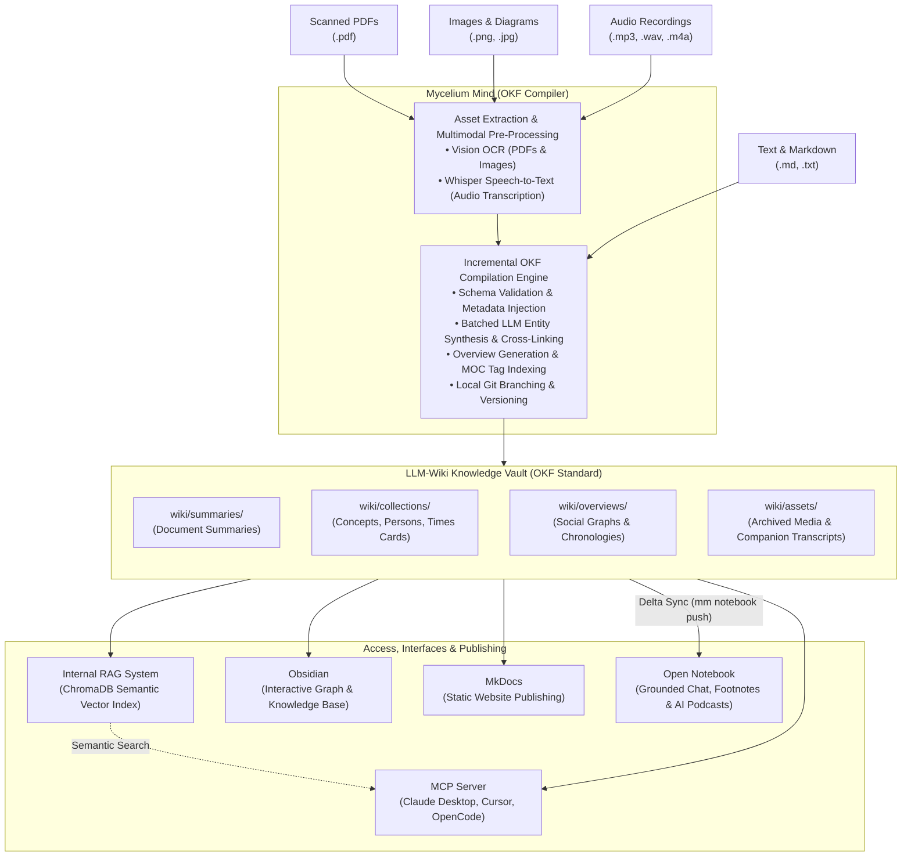
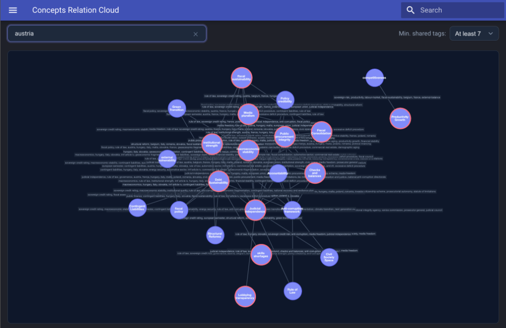
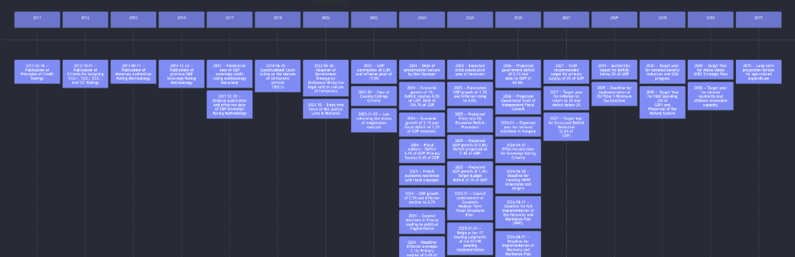
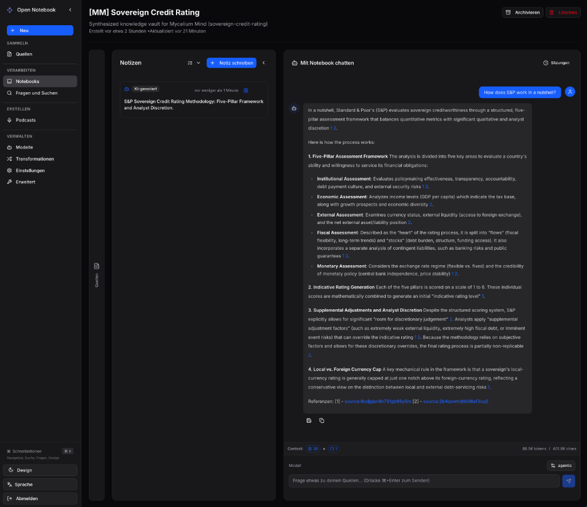

# [Mycelium Mind](https://github.com/pkcpkc/mycelium-mind) 🍄

[Mycelium Mind](https://github.com/pkcpkc/mycelium-mind) is a fully offline, schema-driven, multi-vault compiler pipeline and wiki engine built on top of **Obsidian** and **MkDocs**, powered by local LLMs via an OpenAI-compatible API.

It is designed to ingest raw documents, notes, scanned PDFs, images, and audio recordings (podcasts, voice memos, interviews, meetings), synthesize them into structured metadata-rich cards (conforming to the **Open Knowledge Format (OKF)** standard), dynamically construct interactive relationships between concepts, and compile them into static documentation sites or sync them to an interactive **Open Notebook** research frontend.



---

## 🧩 Dynamic Plugin Architecture (Collections & Overviews)

```mermaid
flowchart TD
    subgraph STAGE1["Stage 1: Summary Ingestion & Entity Extraction"]
        direction LR
        BASE_SUM["Base Summary Config<br/>(config/summary/schema.yml & prompt.md)"]
        EXT_SUM["Summary Schema Extension<br/>(plugins/collections/*/summary-schema-extension.yml)"]
        LLM_SUM["LLM Summarizer<br/>(Extracts entities into frontmatter)"]
        OUT_SUM["wiki/summaries/*.md<br/>(Summaries with entity candidate lists)"]

        BASE_SUM --> LLM_SUM
        EXT_SUM -- "Extends $SCHEMA" --> LLM_SUM
        LLM_SUM --> OUT_SUM
    end

    subgraph STAGE2["Stage 2: Entity Card Compilation"]
        direction LR
        COL_DEF["Collection Definition<br/>(plugins/collections/*/{schema.yml, prompt.md})"]
        LLM_ENT["Entity Compiler Engine<br/>(Evaluates $VALUE, $SCHEMA, $EXISTING_CONTENT)"]
        OUT_ENT["wiki/collections/*/*.md<br/>(Compiled OKF entity cards)"]

        COL_DEF --> LLM_ENT
        LLM_ENT --> OUT_ENT
    end

    subgraph STAGE3["Stage 3: Cross-Entity Overviews & Dashboards"]
        direction LR
        OV_SCRIPTS["Overview Scripts<br/>(plugins/overviews/*.js)"]
        VM_RUNNER["Node.js VM Sandbox<br/>(Builds unified in-memory graph)"]
        OUT_OV["wiki/overviews/*.md<br/>(Timelines, Social Graphs & Registers)"]

        OV_SCRIPTS --> VM_RUNNER
        VM_RUNNER --> OUT_OV
    end

    OUT_SUM -->|"Discovered entity names & context"| LLM_ENT
    OUT_ENT -->|"Compiled entity frontmatters"| VM_RUNNER
    OUT_SUM -.->|"Summary relationships"| VM_RUNNER
```



### How the Dynamic Plugin System Works

Mycelium Mind is built on a convention-over-configuration architecture where knowledge schemas and analytical dashboards are fully decoupled from the core compiler engine:

1. **Zero-Code Dynamic Discovery**:
   - The compiler automatically scans `plugins/collections/` on every execution.
   - Simply adding a new folder (e.g. `plugins/collections/institutions/`) instantly registers `institutions` as a first-class collection with its own schemas, prompt pipelines, and generated folder index (`wiki/collections/institutions/index.md`).

2. **Open Knowledge Format (OKF) Schema Extensions**:
   - **Summary Ingestion Extension (`summary-schema-extension.yml`)**: Extends the base summary schema (`config/summary/schema.yml`). The compiler dynamically stitches all active collection extensions into the `$SCHEMA` variable of `config/summary/prompt.md`. When incoming documents are summarized, the LLM automatically extracts candidate entities under the corresponding collection key (matching both plural and singular forms).
   - **Entity Card Schema & Auto-Injection (`schema.yml`)**: Governs the frontmatter specification for compiled entity cards. The compiler automatically validates types and auto-injects standard OKF system metadata (`timestamp`, `tags`) into the evaluated `$SCHEMA` block to guarantee schema consistency across all collections.
   - **Entity Compilation Prompts (`prompt.md`)**: Instructs the LLM on how to initialize new entity cards or merge new summary mentions into existing cards using evaluated template placeholders (`$VALUE`, `$SCHEMA`, `$EXISTING_CONTENT`, `$SUMMARY_CONTENT`).

3. **Sandboxed Overview Scripting (`node:vm`)**:
   - Rather than using static reporting templates, overview pages (`plugins/overviews/*.js`) run as sandboxed JavaScript scripts inside an isolated Node.js `vm` environment.
   - The engine builds an in-memory unified semantic graph from all compiled entity cards and summaries, exposing high-level query helpers (`getCollection()`, `getSummaries()`, `getPagesByTag()`, `writePage()`).
   - Scripts programmatically evaluate entity relationships, dates, and cross-references to generate dynamic markdown tables, chronologies, and visual Mermaid diagrams (`wiki/overviews/`).

#### Concrete Example: Adding an "Institutions" Collection & Overview

Here is an end-to-end example showing how to introduce an entirely new entity type into your vault without writing any compiler code:

##### 1. Hook into Summary Ingestion (`plugins/collections/institutions/summary-schema-extension.yml`)
Instructs the summarizer to extract institution mentions from raw documents into summary frontmatters:

```yaml
$meta:
  type: Schema
  title: "Institution Summary Extension Schema"
  description: "Defines dynamic institution extraction fields for document summaries."

institutions: [string] # Array | Required | List of institutions, central banks, or regulatory bodies extracted from source.
```

##### 2. Define Entity Card Frontmatter (`plugins/collections/institutions/schema.yml`)
Governs the structured properties on compiled cards in `wiki/collections/institutions/<name>.md`:

```yaml
$meta:
  type: Schema
  title: "Institution Card Schema"
  description: "Defines attributes for compiled institution profiles."

name: string           # String | Required | Official name of the institution.
jurisdiction: string   # String | Optional | Country or regulatory territory.
roles: [string]        # Array  | Optional | Primary mandates (e.g. Central Bank, Sovereign Wealth Fund).
key_officials: [string]# Array  | Optional | Key leadership figures or governors.
```

##### 3. Configure Card Synthesis (`plugins/collections/institutions/prompt.md`)
Guides the LLM on compiling new cards or merging incremental mentions into existing profiles:

````markdown
# Wiki Institution Prompt

You are an expert knowledge extraction agent. Your task is to create or merge information into an Institution profile card.

## Schema Specification
```schema
$SCHEMA
```

## Context
- Institution Name: $VALUE

## Existing Content
```markdown
$EXISTING_CONTENT
```

## New Summary Context
```markdown
$SUMMARY_CONTENT
```

## Target Output Format (Template)

---
[YAML frontmatter matching the Schema Specification above. Ensure type is "Institution", title is "$VALUE", status is "stable", generated is { by: "agentic-compiler", at: "$TIMESTAMP" }, and other fields match the schema.]
---

# $VALUE

## Mandate & Overview
[High-level overview and organizational mission synthesized from summaries...]

## Key Officials & Leadership
- [[Official Name]]: Role / Title

## Associated Entities & Policies
- [[Related Concept or Regulation]]

## Instructions
- If the existing card is empty, generate a new page matching the template.
- If the page already exists, merge new details without overwriting existing facts.
- Internal links must use strict Obsidian wikilinks ([[Entity Name]]).
- Output ONLY the valid markdown content without markdown code wraps.
````

##### 4. Generate Cross-Entity Dashboards (`plugins/overviews/institutions-directory.js`)
Queries the compiled in-memory graph to produce an aggregated directory in `wiki/overviews/institutions-directory.md`:

```javascript
// Query all compiled institution cards from the in-memory graph
const institutions = getCollection('institutions');

// Sort alphabetically by title
institutions.sort((a, b) => (a.title || a.name || '').localeCompare(b.title || b.name || ''));

let body = '# Institutions Directory\n\n';
body += 'A registry of all governmental bodies, central banks, and agencies tracked in the vault.\n\n';
body += '| Institution | Jurisdiction | Key Roles | Key Officials |\n';
body += '| :--- | :--- | :--- | :--- |\n';

for (const inst of institutions) {
  const title = inst.title || inst.name;
  const jurisdiction = inst.jurisdiction ? `[[${inst.jurisdiction}]]` : '—';
  const roles = Array.isArray(inst.roles) ? inst.roles.join(', ') : '—';
  const officials = Array.isArray(inst.key_officials)
    ? inst.key_officials.map(o => `[[${o}]]`).join(', ')
    : '—';

  body += `| [[${title}]] | ${jurisdiction} | ${roles} | ${officials} |\n`;
}

// Emit the compiled markdown page to wiki/overviews/institutions-directory.md
writePage('institutions-directory', {
  title: 'Institutions Directory',
  description: 'Comprehensive registry of tracked institutions and governing bodies.'
}, body);
```

#### Interactive Visualizations & Relationship Clouds

Mycelium Mind automatically generates rich, interactive visual graphs to explore and investigate connections across your knowledge base:

##### 1. Automatic Filterable Entity Relation Clouds
For every collection (e.g. `concepts`, `persons`, `institutions`), the compiler automatically generates a dedicated **Relation Cloud** (`<collection>-cloud.md`), powered by **Cytoscape.js**:
- **Real-Time Keyword Search**: Instantly search and highlight specific entities or themes across the entire collection.
- **Dynamic Threshold Control**: Use the *Min. shared tags* dropdown to filter noise and isolate dense semantic clusters.
- **Interactive Browsing**: Click any node to navigate directly to that entity's compiled card.



##### 2. Custom Overview Visualizations (e.g. Interactive Timelines)
Any overview script in `plugins/overviews/*.js` can programmatically emit its own visual diagrams alongside tabular registries:
- **Interactive Chronological Timeline (`timeline.js`)**: Compiles both a tabular directory (`wiki/overviews/timeline.md`) and a visual **Chronological Timeline** (`wiki/overviews/timeline-graphic.md`) rendered using Mermaid.
- **Search & Tag Filtering**: Includes client-side real-time keyword search and tag threshold filtering (`timeline-filter.js`) to inspect milestones, events, and citations by year.
- **Social Graphs (`social-graph.js`)**: Dynamically compiles Mermaid relationship diagrams mapping connections between key figures, institutions, and collaborators.



---

## 🎨 Design & Core Principles

1. **Local & Offline First**: Designed to run entirely on your local machine using local LLMs (e.g. via oMLX, llama.cpp, Ollama, or LM Studio) through standard OpenAI-compatible API endpoints.
2. **Multimodal & Audio Ingestion**: Natively processes text, markdown, scanned documents/images (OCR), and voice recordings/podcasts (Speech-to-Text via Whisper), converting unstructured media into structured markdown before entity synthesis.
3. **Strict Schema Validation & Auto-Injection**: Vault entities are governed by markdown-defined schema specifications. Common system metadata such as `timestamp` and `tags` are automatically injected into the schema definitions and processed frontmatter at compile-time to reduce LLM prompt size and guarantee schema consistency.
4. **Isolated LLM Invocations**: To prevent context window overflow, each raw inbox document is processed individually. Entity syntheses are batched and compiled incrementally to scale to large vaults.
5. **Git-Backed Version Control**: The compiler performs local git commits and tags directly inside the directory of each target wiki, ensuring clean revision history local to the vault itself.
6. **Decoupled Architecture**: Each CLI command operates independently. Folder structures are dynamically inspected, allowing you to easily add new schemas, collections, or custom overview scripts.

---

## 🌐 Live Reference Example: Sovereign Credit Rating

A complete, production reference example of a Mycelium Mind vault in action is available at:

- **GitHub Repository**: [pkcpkc/sovereign-credit-rating](https://github.com/pkcpkc/sovereign-credit-rating)
- **Live Demo Site**: [Sovereign Credit Rating Knowledge Vault (GitHub Pages)](https://pkcpkc.github.io/sovereign-credit-rating/)

This reference vault showcases custom collections (`sovereign-credit-rating-factors`, `methods`, `persons`, `times`), entity synthesis, dynamic timeline and social graph overviews, interactive Cytoscape relation clouds, and automated publishing via GitHub Actions.

---

## 🛠️ Quick Start Guide

### 1. Prerequisites & Installation

Clone the repository and install the dependencies:

```bash
# Clone the repository
git clone https://github.com/pkcpkc/mycelium-mind.git
cd mycelium-mind

# Install Node & Python runtimes via mise
mise install

# Install project dependencies (automatically installs Node and Python environment/requirements)
npm install

# Manually trigger Python setup if needed (re-creates .venv and installs requirements.txt)
npm run setup
```

### 2. Configure Your Local Model Endpoints

You can centralize all model configurations directly inside your vault's `config/config.yml`, or supply them via environment variables in `.env`.

**Centralized `config/config.yml` (Recommended):**
```yaml
models:
  api_url: "http://127.0.0.1:8000/v1"  # Base OpenAI-compatible API URL (e.g. oMLX, LM Studio, Ollama)
  base: "agentic"                       # Main model for summarization & card compilation
  ocr: "ocr"                           # OCR model for scanned documents, PDFs & images
  image: "agentic"                     # Vision / multimodal model
  stt: "stt"                           # Speech-to-Text model for audio files (.mp3, .wav, .m4a)
  tts: "tts"                           # Text-to-Speech model for voice synthesis
  embedding: "embeddings"              # Embedding model for vector indexing
```

Secrets such as `BASE_MODEL_API_KEY` remain safely isolated in your `.env` file:
```env
BASE_MODEL_API_KEY="your-api-key"
```

#### 💡 Recommended Local Models (Apple Silicon & oMLX)

For local execution on macOS (Apple Silicon), [**oMLX**](https://github.com/filip-stefaniak/omlx) is the recommended inference runner. It provides native Apple Silicon acceleration, continuous batching, and serves all required modalities (LLM, Embeddings, STT Whisper, TTS Kokoro, Vision) via standard OpenAI-compatible endpoints (`/v1/chat/completions`, `/v1/embeddings`, `/v1/audio/transcriptions`, `/v1/audio/speech`).

| Modality | Recommended Model (MLX) | Memory | Notes & Best Practices |
| :--- | :--- | :--- | :--- |
| **Compiler & Chat LLM** | `mlx-community/Qwen2.5-14B-Instruct-4bit` | ~8.5 GB | Strong reasoning & schema compliance (16–24GB Macs). |
| | `mlx-community/Qwen2.5-32B-Instruct-4bit` | ~19 GB | Top-tier entity synthesis and nuanced relationships (32GB+ Macs). |
| **Embeddings** | `mlx-community/bge-m3-mlx-fp16` | ~1.1 GB | Dense & multilingual. **Pick FP16 over 8-bit** to avoid vector cosine distance degradation. |
| **Speech-to-Text (STT)** | `mlx-community/whisper-large-v3-turbo` | ~1.6 GB | High-speed, multilingual audio transcription. **Pick FP16 over 4-bit (`q4`)** to prevent hallucinated acronyms, names, and numbers. |
| **Text-to-Speech (TTS)** | `mlx-community/Kokoro-82M-bf16` | ~170 MB | Ultra-fast, natural audio synthesis for Open Notebook podcasts. Pick **bf16** over 4-bit to prevent robotic artifacts. |
| **Vision / OCR** | `mlx-community/Qwen2-VL-7B-Instruct-4bit` | ~5.5 GB | Scanned documents, PDFs, and diagram extraction. |

### 3. Initialize a Wiki Vault

Initialize a new vault structure in your chosen directory:

```bash
# Using global alias 'mm'
mm init ./my-first-wiki
```

> [!NOTE]
> This command populates folder structures, base prompts, default collection schemas (concepts, persons, times), and initializes a local git repository inside the vault folder.

### 4. Sync the Inbox (Multimodal & Audio Ingestion)

Drop raw files into `./my-first-wiki/inbox/`:
- **Text & Markdown**: Notes, research papers, documentation (`.md`, `.txt`).
- **Audio Files**: Voice memos, podcast episodes, meeting recordings, lectures (`.mp3`, `.wav`, `.m4a`, `.ogg`, `.flac`, `.aac`, `.opus`, `.webm`, `.wma`).
- **Scanned PDFs & Images**: Whiteboards, book pages, diagrams (`.pdf`, `.png`, `.jpg`, `.jpeg`).

Then run the compiler:

```bash
mm sync ./my-first-wiki
```

This runs the automated multimodal compilation pipeline:
1. **Asset Extraction & Transcription**:
   - **Audio recordings** are automatically transcribed into markdown notes via local Speech-to-Text (`models.stt`, e.g. Whisper).
   - **PDFs and images** are extracted and transcribed via local OCR (`models.ocr`).
2. **Summarization**: Generates focused source summaries in `wiki/summaries/`.
3. **Asset Archiving**: Preserves original media files and companion notes into dated folders under `wiki/assets/YYYY-MM-DD/`.
4. **Entity Compilation**: Batches and merges newly discovered information into entity cards under `wiki/collections/` (`concepts`, `persons`, `times`, etc.).
5. **Overviews & MOCs**: Executes sandboxed overview scripts and regenerates tag indexes and relationship graphs.
6. **Git Versioning**: Automatically commits the resulting changes to the vault's local Git repository.


## 🔌 Semantic Search & AI Integration (MCP / RAG)

Mycelium Mind features a built-in **Model Context Protocol (MCP)** server that exposes your offline wiki as an active semantic vector database. This allows AI assistants in clients like **OpenCode**, **Cursor**, or **Claude Desktop** to search and reference your wiki directly.

To start the RAG server:
```bash
# Start SSE server (default, on port 8179)
mm rag ./my-first-wiki

# Start stdio server (for IDE-spawned integrations)
mm rag ./my-first-wiki --transport stdio
```

### Quick Integration Example: OpenCode

To configure **OpenCode** to automatically spawn and query your local RAG server, add the server configuration to your project's `opencode.json` (or your global `~/.config/opencode/opencode.json`):

```json
{
  "$schema": "https://opencode.ai/config.json",
  "mcp": {
    "mycelium-mind": {
      "type": "local",
      "command": [
        "node",
        "/absolute/path/to/mycelium-mind/build/cli.js",
        "rag",
        "/absolute/path/to/your/wiki",
        "--transport",
        "stdio"
      ],
      "enabled": true
    }
  }
}
```

> [!NOTE]
> Ensure you replace `/absolute/path/to/mycelium-mind/` and `/absolute/path/to/your/wiki` with the actual absolute paths on your machine. OpenCode requires the `command` field to be defined as an array of arguments.

See [**MCP & RAG Search Server Documentation**](docs/mcp.md) for Cursor, Claude Desktop, and other client integration guides.


## 📓 Open Notebook Integration



Mycelium Mind integrates optionally with [**Open Notebook**](https://github.com/lfnovo/open-notebook)—an open-source, self-hosted alternative to Google's NotebookLM.

While Mycelium Mind acts as your **curated library of record** (Git-backed, schema-validated, entity-linked markdown), Open Notebook provides an **interactive research workbench**:
- **Multi-source grounded chat**: Select specific cards or summaries and ask questions with cited footnotes.
- **AI-generated podcasts**: Create multi-speaker conversational audio overviews from your synthesized knowledge.
- **Ad-hoc research sandbox**: Mix your compiled vault knowledge with temporary PDFs, web URLs, or YouTube links directly in the Open Notebook UI.

### 1. Launch Open Notebook (Colima or Docker on macOS)

You can run Open Notebook with Docker Desktop or with **[Colima](https://github.com/abiosoft/colima)** (recommended on macOS for a lightweight, 100% open-source container runtime without Docker Desktop memory overhead or licensing constraints):

```bash
# Install Colima & Docker CLI via Homebrew
brew install colima docker docker-compose

# Start Colima & Open Notebook in one command (auto-detects daemon and auto-provisions models)
mm notebook start

# Check full environment health (Colima VM, Docker daemon, containers, API)
mm notebook status

# Re-apply centralized model settings anytime without restarting containers
mm notebook configure

# Stop Open Notebook (and stop Colima VM with --colima)
mm notebook stop --colima

# Direct Colima runtime controls
mm notebook colima status
```

> [!NOTE]
> `mm notebook start` automatically provisions the AI models specified in `config/config.yml` (bridging `localhost` to `host.docker.internal` for Docker by default, or using your explicit `notebook.model_api_url` verbatim).
> Once started, access the Web UI at **`http://localhost:8502`** and Swagger API docs at **`http://localhost:5055/docs`**.

### 2. Push Vault Cards (Stateless Delta Sync)

```bash
# Push compiled entity cards and summaries into Open Notebook
mm notebook push ./my-first-wiki

# Filter what gets synced (all, collections, or summaries)
mm notebook push ./my-first-wiki --filter collections

# Preview changes with dry-run before uploading
mm notebook push ./my-first-wiki --dry-run

# Prune cards from Open Notebook that were deleted in the vault
mm notebook push ./my-first-wiki --prune

# Force re-upload of all cards bypassing hash checks
mm notebook push ./my-first-wiki --force
```

> [!TIP]
> **Zero Re-indexing Overhead:** Pushes are strictly incremental. The sync engine compares content SHA-256 hashes against Open Notebook's live sources. Unchanged cards are skipped instantly with **0 network uploads and 0 re-embeddings**.

### 3. Manage Notebooks

```bash
# List available notebooks and source counts
mm notebook list

# Create a new dedicated project notebook
mm notebook create "Cancer Research 2026"
```

### 4. oMLX & Container Networking Hints

When running Open Notebook in Docker/Colima alongside local inference on macOS:

> [!IMPORTANT]
> **Host Network Bridging (`host.docker.internal`):**
> Inside Docker containers, `localhost` or `127.0.0.1` refers to the container itself. To connect to your local **oMLX** server running on the Mac host, Open Notebook must reach **`http://host.docker.internal:8000/v1`**.
> `mm notebook start` and `mm notebook configure` handle this configuration automatically using the base URL from your `config/config.yml`.

> [!TIP]
> **Unlock All 4 Modalities in Open Notebook (Language, Embedding, STT, TTS):**
> Open Notebook includes a native "oMLX" preset, but it currently only exposes Chat and Embedding slots because it does not yet register oMLX's audio endpoints.
> To enable **AI-generated podcasts** and voice interactions using oMLX, configure your local oMLX endpoint under the **OpenAI** provider preset in Open Notebook (*Settings > Models & Credentials*) with Base URL `http://host.docker.internal:8000/v1`. This unlocks all 4 capability slots (Chat, Embedding, STT Whisper, and TTS Kokoro) simultaneously.


## 💡 Best Practices

For the most efficient and robust workflow, follow these best practices when managing your wiki vault:

1. **Schema & Plugin Setup**: Setup or copy your plugins from the built-in library (using `mm collection [name]` or `mm overview [name]`) or create your own custom schemas under `plugins/collections/`.
2. **Inbox Ingestion & Sync**: Drop raw documents into the `inbox/` directory and run `mm sync`. By default, this compiles changes on a separate git branch and automatically creates a pull request (use `--no-pr` to disable).
3. **Browsing & Publishing**: Compile your static wiki site using `mm publish` to deploy anywhere (e.g., GitHub Pages), or use **Obsidian** locally to browse your interactive graph and markdown pages.
4. **Manual Edits & Overrides**: If you edit your markdown pages manually or via Obsidian, run `mm overrides` (use `--no-pr` to skip branch/PR creation). This updates the frontmatter and concerned collection entities according to your changes, and preserves them to be correctly replayed during any future `mm resync`.

---

## 📚 Documentation & Guides

For in-depth guides, layout maps, scripting specifications, and references, see the detailed documentation folders:

*   [**CLI Command Reference**](docs/cli.md): In-depth guide to using the `mm` binary, flags, options, and commands.
*   [**Custom Collection Plugins**](docs/plugins.md): How to create custom collection pipelines with schemas, prompts, and evaluated placeholders.
*   [**Custom Overviews & Sandbox Scripting**](docs/overviews.md): Writing custom script plugins inside VM contexts to build reports, directories, and visual charts.
*   [**Pipeline Architecture & Repository Layout**](docs/architecture.md): A guide to the compiler pipeline stages, directory layouts, runtimes, and testing environment.
*   [**MCP & RAG Search Server**](docs/mcp.md): Connecting external AI clients (like Cursor, Claude Desktop, or OpenCode) to query your wiki semantically.

---

## 🚀 Release Process

To publish a new version of `mycelium-mind` to npm:

1. **Log in to npm**:
   ```bash
   npm login
   ```
2. **Publish the package with public access**:
   ```bash
   npm publish --access public
   ```

*(The `prepare` script automatically runs `npm run build` prior to publishing).*

