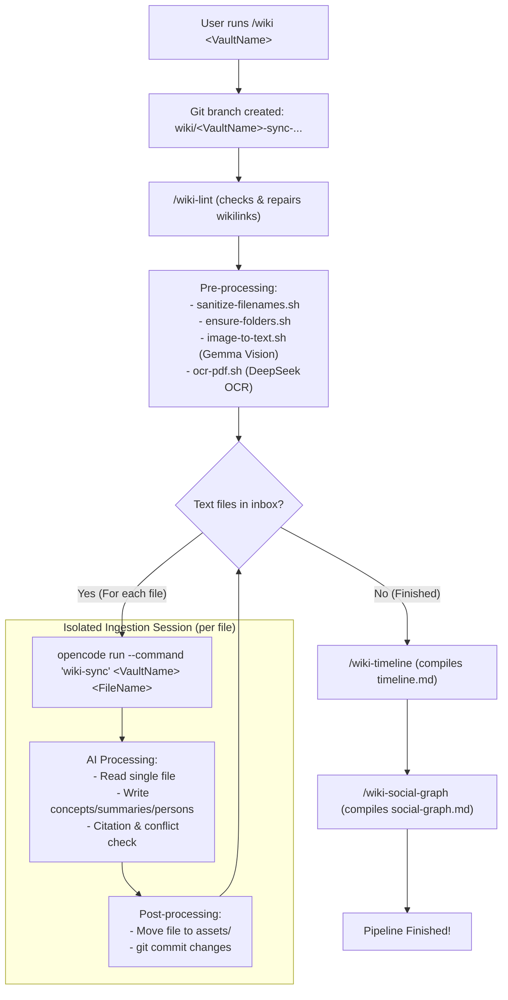

# Mycelium Mind

Mycelium Mind is a fully offline, multi-vault wiki engine built on top of Obsidian, powered by local LLMs running on oMLX.

Inspired by [karpathy's llm-wiki](https://gist.github.com/karpathy/442a6bf555914893e9891c11519de94f) and orchestrated via [OpenCode](https://opencode.ai/).

---

## 🚀 Quick Start (Offline Ingestion)

Follow this sequence to ingest your files into a clean Obsidian wiki vault:

### 1. Prerequisites
Install **Obsidian**, and fetch the CLI tools:
```bash
brew bundle install
gh auth login
```

### 2. Configure Local Models (oMLX)
Start your local oMLX server hosting the following models:
* **Text:** `Qwen3.6-35B`
* **Vision:** `Gemma-4-31B-IT` (image analysis)
* **OCR:** `DeepSeek-OCR-2-bf16` (PDF extraction)

Create a `.env` in the repository root:
```env
API_URL="http://localhost:8000/v1/chat/completions"
API_KEY="your-api-key"
OCR_MODEL_NAME="DeepSeek-OCR-2-bf16"
IMAGE_MODEL_NAME="gemma-4-31b-it-4bit"
```

Configure OpenCode's main text model in `.opencode/models.yaml`:
```yaml
default:
  api_url: "http://localhost:8000/v1"
  api_key: "your-api-key"
  model: "Qwen3.6-35B-A3B-UD-MLX-4bit"
```

### 3. Drop & Process Files
1. Create your vault folder structure:
   ```bash
   mkdir -p Vaults/LLM-Wiki/inbox Vaults/LLM-Wiki/wiki
   ```
2. Place raw PDFs, images, text, or markdown files into `Vaults/LLM-Wiki/inbox/`.
3. In your OpenCode terminal, run the orchestrator:
   ```bash
   /wiki LLM-Wiki
   ```
4. Open the compiled `Vaults/LLM-Wiki/wiki/` folder in **Obsidian** to view your synced wiki!

---

## 🛠️ Complete Pipeline & Hook Flowchart

Mycelium Mind uses a modular, hook-driven architecture. The `/wiki <VaultName>` command chain is fully visualized below, showing the new **context-isolated ingestion loop** designed to keep local inference memory and token overhead minimal.



---

## 📂 Vault Schema & Directory Map

Inside your compiled `Vaults/<VaultName>/wiki/` vault, Mycelium Mind maintains a strict schema:

* `index.md` — The Map of Content (entry directory).
* `timeline.md` — Global sorted timeline of events.
* `social-graph.md` — Mermaid relationship chart of all persons.
* `concepts/` — Topic and concept notes.
* `persons/` — Biographies and affiliations.
* `summaries/` — Synthesis cards for raw documents.
* `reports/` — Cross-vault thematic syntheses (compiled via `/wiki-report`).
* `assets/` — Archive of raw documents sorted by date of ingestion (`assets/YYYY-MM-DD/`).

---

## 🧩 Commands Reference

All subcommands run independently in OpenCode:

| Command | Target Output | Description |
| :--- | :--- | :--- |
| `/wiki <Vault>` | Whole vault | Runs the entire pipeline sequentially (Branching, Linting, Syncing, Timeline, Social-Graph). |
| `/wiki-sync <Vault> [File]` | `summaries/`, `concepts/`, `persons/` | OCR/Vision extracts document content, and the LLM synthesizes entries. Passing `[File]` syncs only that single file. |
| `/wiki-diff <Vault>` | Selective updates | Checks unstaged Git changes in the vault, processing only recent manual modifications. |
| `/wiki-lint <Vault>` | Interactive audit | Checks for broken wikilinks, orphaned pages, or stubs. |
| `/wiki-timeline <Vault>` | `timeline.md` | Extracts dates and compiles them chronologically. |
| `/wiki-social-graph <Vault>`| `social-graph.md` | Scrapes entity relationships and builds the Mermaid chart. |
| `/wiki-report <Vaults> <Q>` | `reports/` | Synthesizes a thematic study across multiple vaults. |

---

## 🔗 Hook-Based Modularity & Pipeline Extension

Mycelium Mind is designed around **single-responsibility, decoupled commands** that build on top of each other. This is orchestrated via the Command Hooks plugin (`@pkcpkc/opencode-plugin-command-hooks`), which executes sequential shell scripts and OpenCode commands before and after a main command executes.

Because commands are completely modular, you can easily extend the ingestion pipeline with new LLM-driven features (e.g. generating custom category indices, extracting semantic structures, or running topic-specific syntheses).

### Case Study: Adding a `/wiki-companies` Command
Suppose we want to automatically scan all ingested text, identify mentioned companies, and compile a dedicated profile page for each under `wiki/companies/`.

#### Step A: Define the Command Prompt (`.opencode/commands/wiki-companies.md`)
Create a prompt instructing the LLM on how to extract and format company pages:
```markdown
---
description: Scans summaries and concepts to identify companies and compile profile pages under companies/. Usage: /wiki-companies <VaultName>
---
# Wiki Companies Command

## Context
Vault Name: $1

## Instructions
1. Scan `./Vaults/$1/wiki/summaries/` and `./Vaults/$1/wiki/concepts/`.
2. Extract all mentioned business entities or companies.
3. For each unique company, write or update `./Vaults/$1/wiki/companies/[Company Name].md` containing:
   - `# [Company Name]`
   - **Founders & Core Leadership**
   - **Key Products/Technologies**
   - **Context & Operations** (Synthesized from citations)
   - Source attributions following the `wiki-core` standard.
```

#### Step B: Declare Hooks (`.opencode/commands/wiki-companies.hooks.json`)
Configure the pre-script to ensure the target directory exists:
```json
{
  "scripts": {
    "pre": [
      "mkdir -p ./Vaults/$1/wiki/companies"
    ]
  }
}
```

#### Step C: Append to the Master Pipeline (`.opencode/commands/wiki.hooks.json`)
To make this new company extraction execute automatically whenever you run `/wiki <VaultName>`, simply append it to the post-commands array in the master hooks file:
```json
{
  "commands": {
    "post": [
      "wiki-sync $1",
      "wiki-timeline $1",
      "wiki-social-graph $1",
      "wiki-companies $1"
    ]
  }
}
```

---

## 🔌 Model Context Protocol (MCP) Integration

Mycelium Mind exposes your vaults programmatically to other LLM interfaces (Claude Desktop, Cursor, Cline, Roo Code) via MCP. 

Register the server by adding this to your MCP configuration (`mcp_config.json`):

```json
{
  "mcpServers": {
    "mycelium-mind": {
      "command": "node",
      "args": [
        "/Users/pkc/Projects/mycelium-mind/mcp/build/index.js",
        "--vault=LLM-Wiki"
      ],
      "cwd": "/Users/pkc/Projects/mycelium-mind/mcp"
```

*Note: Omit `--vault=<name>` to run in **Multi-Vault Mode**, which activates vault discovery (`get_vaults`) and exposes all vaults under `Vaults/`.*
For detailed configuration and API tool schemas, see the [MCP README](file:///Users/pkc/Projects/mycelium-mind/mcp/README.md).
