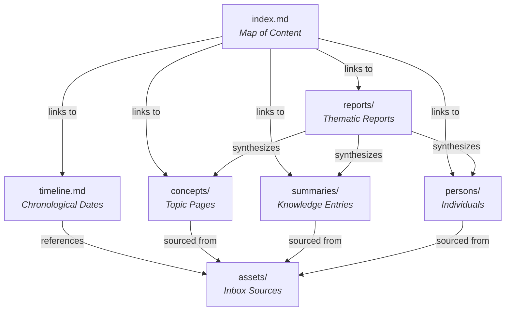
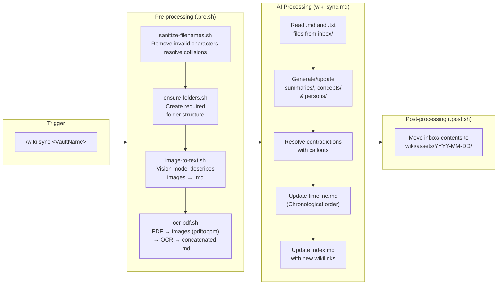
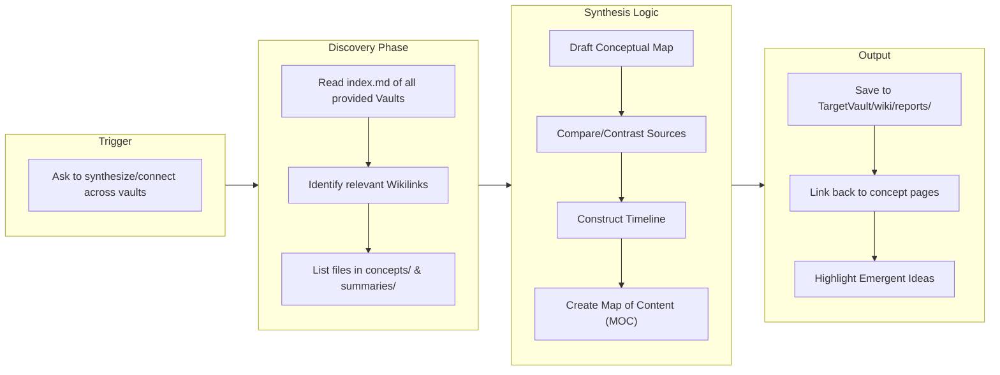

# MindVault

A fully offline, multi-vault wiki engine built on top of Obsidian, powered by local LLMs running on oMLX.

Inspired by [karpathy's llm-wiki](https://gist.github.com/karpathy/442a6bf555914893e9891c11519de94f).

Implemented by [Paul Hackenberger](https://www.linkedin.com/in/paul-hackenberger/) and [Google Antigravity](https://antigravity.google/).

## Architecture

```
.opencode/
  ├── commands/               <- Slash-commands (explicit actions)
  │   ├── wiki-sync.md            <- Main AI processing logic (Multi-Vault)
  │   ├── wiki-sync.pre.sh        <- Pre-hook: sanitize, OCR, image-to-text
  │   ├── wiki-sync.post.sh       <- Post-hook: asset mapping & archiving
  │   ├── wiki-sync/              <- Sub-scripts for pre-processing
  │   │   ├── sanitize-filenames.sh
  │   │   ├── ensure-folders.sh
  │   │   ├── image-to-text.sh
  │   │   └── ocr-pdf.sh
  │   ├── wiki-lint.md            <- Wiki health check command
  │   ├── wiki-report.md          <- Wiki report generator command
  │   └── wiki-report.pre.sh      <- Pre-hook: ensure folders for reports
  ├── skills/                 <- Skills (auto-triggered by context)
  │   └── wiki-qa/SKILL.md       <- Retrieval-augmented Q&A
  └── plugins/
      └── commandHooks.ts        <- Lifecycle hooks (pre/post script runner)
Vaults/                       <- Multi-Vault Management
  ├── <VaultName>/
  │   ├── inbox/                    <- Drop PDFs, images, text files here
  │   └── wiki/                   <- Your Obsidian vault
  │       ├── index.md                <- Map of Content
  │       ├── timeline.md             <- Chronological timeline of all dates
  │       ├── concepts/               <- Topic pages (entities, tools)
  │       ├── persons/                <- Individuals and their related data
  │       ├── summaries/              <- Processed knowledge entries
  │       ├── reports/                <- On-demand generated thematic reports
  │       └── assets/                 <- Moved inbox sources (e.g., assets/YYYY-MM-DD/)
```

### Vault Data Relations



## Skills & Commands

MindVault uses two different mechanisms to interact with the AI. Understanding when each fires is key:

### Commands (explicit — you type them)

Commands are **slash-commands** you invoke manually in opencode with `/command-name <VaultName>`. They trigger specific, well-defined workflows.

| Command                                            | File                      | When to use                                                                                                                                                   |
| -------------------------------------------------- | ------------------------- | ------------------------------------------------------------------------------------------------------------------------------------------------------------- |
| `/wiki-sync <VaultName>`                           | `commands/wiki-sync.md`   | You've dropped new files into `Vaults/<VaultName>/inbox/` and want to process them into the vault. This is the main ingestion pipeline.                       |
| `/wiki-lint <VaultName>`                           | `commands/wiki-lint.md`   | You want a health check — find broken `[[Wikilinks]]`, orphaned pages, stub articles, duplicates, or stale content. Reports issues first, asks before fixing. |
| `/wiki-report vault1{,vault2...} <Report Inquiry>` | `commands/wiki-report.md` | You want to generate thematic reports across one or more vaults. Creates Map-of-Content pages in the target vault's `wiki/reports/` folder.                   |

### Skills (implicit — they activate automatically)

Skills are **context-triggered**. The AI activates them automatically when your message matches their description. You don't need to type anything special.

| Skill        | File                      | Activates when…                                                                                                                                             |
| ------------ | ------------------------- | ----------------------------------------------------------------------------------------------------------------------------------------------------------- |
| **Wiki Q&A** | `skills/wiki-qa/SKILL.md` | You **ask a question** about your wiki content. Uses retrieval-augmented search across a vault to find answers, always citing sources with `[[Wikilinks]]`. |

## How `/wiki-sync` Works

The core pipeline is the `/wiki-sync` command. When invoked in opencode with a vault name (e.g., `/wiki-sync Me`), it triggers a three-phase automated pipeline:



### Phase Details

1. **Pre-processing** (`wiki-sync.pre.sh`) — runs automatically before the AI sees anything:
   - **Sanitize filenames** — strips invalid characters (`\ / : * ? " < > |`), deduplicates names.
   - **Ensure folders** — ensures the required directory structure exists.
   - **Image-to-text** — sends images in `inbox/` to a vision model (Gemma) for semantic descriptions, saves as `image.png.md`.
   - **OCR PDFs** — converts each PDF page to a 300 DPI image via `pdftoppm`, sends pages to an OCR model (DeepSeek-OCR), concatenates results into `document.pdf.md`, then cleans up the temp folder.

2. **AI Processing** (`wiki-sync.md`) — the LLM reads the extracted `.md`/`.txt` files and:
   - Creates or updates summary pages in `wiki/summaries/`.
   - Extracts entities and appends new data to `wiki/concepts/`.
   - Extracts persons and appends new files to `wiki/persons/`.
   - Handles contradictions with `> [!warning] Contradiction` callouts.
   - Attributes every claim with `[source: <VaultName>/wiki/assets/YYYY-MM-DD/file.md]`.
   - Updates `wiki/index.md` with new `[[Wikilinks]]`.
   - Generates or updates `timeline.md`, extracting all dates mentioned and creating a chronologically ordered list with wikilinks to the source `.md` files.

3. **Post-processing** (`wiki-sync.post.sh`) — runs automatically after the AI finishes:
   - Moves the `inbox/` directory contents into `wiki/assets/YYYY-MM-DD/` and recreates a fresh, empty `inbox/` folder for the next batch. This effectively keeps all your binary assets and generated text natively within the specific vault, systematically organized by ingestion date.

## How `/wiki-report` Works

The **Wiki Reporter** is designed to seamlessly span multiple vaults. When you trigger the `/wiki-report` command or ask to generate a report across one or more `<VaultName>`s, it kicks off a multi-vault discovery and integration process.



### Synthesis Workflow

- **Target Vault:** The _first_ vault provided is treated as the target destination.
- **Discovery:** The command reads the `index.md`, `timeline.md`, `concepts/`, `persons/`, and `summaries/` of _all_ provided vaults to surface themes.
- **Synthesis:** Compares sources (highlighting agreements or disparities), creates chronological timelines for historical themes, and structures everything into a Map of Content (MOC).
- **Output:** Saves the output to `Vaults/<TargetVaultName>/wiki/reports/`, ensuring every paragraph links back to at least two existing wiki concept pages, and highlighting "emergent" insights using `> [!abstract] Key Insight` callouts.

### When to Use What

| You want to…                                   | Use                                           |
| ---------------------------------------------- | --------------------------------------------- |
| Process new PDFs/images/notes                  | `/wiki-sync <VaultName>`                      |
| Check wiki health & consistency                | `/wiki-lint <VaultName>`                      |
| Ask "What does my vault say about X?"          | Just ask — **Wiki Q&A** activates             |
| "Generate a report across Vault A and Vault B" | `/wiki-report VaultA,VaultB <Report-Inquiry>` |

## Automation Hooks (Plugin)

The **Command Hooks** plugin (`.opencode/plugins/commandHooks.ts`) is what makes the pre/post scripts run automatically. It:

- Intercepts `command.execute.before` events → runs `commands/<name>.pre.sh <args>`
- Intercepts `command.executed` events → runs `commands/<name>.post.sh <args>`
- Shows toast notifications for progress and success/failure
- Logs execution results into the chat session for visibility
- Writes detailed logs to `.opencode/plugins/commandHooks.log`

This means any new command you create can have its own shell hooks — just add `<command-name>.pre.sh` or `<command-name>.post.sh` next to its `.md` file. They will automatically receive any arguments passed to the slash command (like `<VaultName>`).

## Models & Tools

All of these run **fully offline** on your local machine:

### Models

| Model              | Role                                                       |
| ------------------ | ---------------------------------------------------------- |
| **Qwen3.6-35B**    | Main LLM for wiki processing, synthesis, Q&A, and linting. |
| **Gemma-4-31B-IT** | Vision model for semantic image descriptions.              |
| **DeepSeek-OCR-2** | OCR model for extracting text from document images.        |

### Tools

| Tool                                            | Role                                                                            |
| ----------------------------------------------- | ------------------------------------------------------------------------------- |
| **[omlx](https://omlx.ai/)**                    | Local model server for running LLMs.                                            |
| **[poppler](https://poppler.freedesktop.org/)** | PDF utilities (`pdftoppm` for PDF → image conversion).                          |
| **[jq](https://jqlang.github.io/jq/)**          | Command-line JSON processor for API interactions.                               |
| **[opencode](https://opencode.ai/)**            | AI coding assistant with commands, skills, and plugins loaded via `.opencode/`. |
| **[Obsidian](https://obsidian.md/)**            | Knowledge base viewer and editor.                                               |

### Installation

Ensure you have the system dependencies installed:

```bash
brew bundle install
```

## Configuration (`.env`)

All config lives in `.env` at the project root.

```env
# Local model API endpoint
API_URL="http://localhost:8000/v1/chat/completions"
API_KEY="your-api-key"

# Model names (main model configured in .opencode/models.yaml)
OCR_MODEL_NAME="DeepSeek-OCR-2-bf16"
IMAGE_MODEL_NAME="gemma-4-31b-it-4bit"
```

## Getting Started

1. Install system dependencies: `brew bundle install`
2. Install a local model server (Ollama, vLLM, or MLX) and pull the required models.
3. Fill in `.env` with your local server details.
4. Create a new vault: `mkdir -p Vaults/Me/inbox Vaults/Me/wiki`
5. Drop PDFs or images into `Vaults/Me/inbox/`.
6. Run `/wiki-sync Me` in opencode to process your files.
7. Open the `Vaults/Me/wiki` folder in Obsidian to explore your new knowledge vault.

## Acknowledgements

Thanks for inspiration to [Dan-Yoel Bittner](https://www.linkedin.com/in/dan-yoel-bitter-617a74157/) and [Rainer Kruschwitz](https://www.linkedin.com/in/kruschwitz/).
