# Social Graph

Interactive social graph and detailed connection map of the individuals in this vault.

## Mermaid Diagram

```mermaid
flowchart TD
  AK["Andrej Karpathy"]
  FFL["Fei-Fei Li"]
  GH["Geoff Hinton"]
  AN["Andrew Ng"]
  DK["Daphne Koller"]
  ST["Sebastian Thrun"]
  VK["Vladlen Koltun"]
  MVP["Michiel van de Panne"]
  KK["Koray Kavukcuoglu"]
  VM["Vlad Mnih"]
  JJ["Justin Johnson"]
  PA["Pieter Abbeel"]
  JH["Jensen Huang"]
  DDK["Diederik P. Kingma"]
  TS["Tim Salimans"]
  XC["Xi Chen"]
  YB["Yaroslav Bulatov"]
  AJ["Armand Joulin"]
  RS["Richard Socher"]
  QVL["Quoc V. Le"]
  CDM["Christopher D. Manning"]
  PL["Percy Liang"]
  AC["Adam Coates"]
  TS2["Tianlin Shi"]
  LF["Linxi Fan"]
  JHern["Jonathan Hernandez"]
  OR["Olga Russakovsky"]
  JD["Jia Deng"]
  HS["Hao Su"]
  JK["Jonathan Krause"]
  SS["Sanjeev Satheesh"]
  GT["George Toderici"]
  SSh["Sanketh Shetty"]
  TL["Thomas Leung"]
  RSh["Rahul Sukthankar"]

  AK -- "advised by" --> FFL
  AK -- "first exposed to deep learning by" --> GH
  AK -- "worked with (rotation)" --> AN
  AK -- "worked with (rotation)" --> DK
  AK -- "worked with (rotation)" --> ST
  AK -- "worked with (rotation)" --> VK
  AK -- "advised by (MSc)" --> MVP
  AK -- "interned with" --> KK
  AK -- "interned with" --> VM
  AK -- "collaborated on DenseCap" --> JJ
  AK -- "podcast guest" --> PA
  AK -- "keynote with" --> JH
  AK -- "collaborated on PixelCNN++" --> DDK
  AK -- "collaborated on PixelCNN++" --> TS
  AK -- "collaborated on PixelCNN++" --> XC
  AK -- "collaborated on PixelCNN++" --> YB
  AK -- "collaborated on Deep Fragment Embeddings" --> AJ
  AK -- "collaborated on Grounded Compositional Semantics" --> RS
  AK -- "collaborated on Grounded Compositional Semantics" --> QVL
  AK -- "collaborated on Grounded Compositional Semantics" --> CDM
  AK -- "collaborated on Grounded Compositional Semantics" --> AN
  AK -- "collaborated on World of Bits" --> PL
  AK -- "collaborated on World of Bits" --> TS2
  AK -- "collaborated on World of Bits" --> LF
  AK -- "collaborated on World of Bits" --> JHern
  AK -- "collaborated on Emergence of Object-Selective Features" --> AC
  AK -- "collaborated on Emergence of Object-Selective Features" --> AN
  AK -- "collaborated on ImageNet JCV" --> OR
  AK -- "collaborated on ImageNet JCV" --> JD
  AK -- "collaborated on ImageNet JCV" --> HS
  AK -- "collaborated on ImageNet JCV" --> JK
  AK -- "collaborated on ImageNet JCV" --> SS
  AK -- "collaborated on Large-Scale Video Classification" --> GT
  AK -- "collaborated on Large-Scale Video Classification" --> SSh
  AK -- "collaborated on Large-Scale Video Classification" --> TL
  AK -- "collaborated on Large-Scale Video Classification" --> RSh
  AK -- "collaborated on Large-Scale Video Classification" --> FFL
  AK -- "collaborated on DenseCap" --> FFL
  AK -- "collaborated on Deep Visual-Semantic Alignments" --> FFL
  AN -- "worked with (rotation)" --> AK
  AN -- "collaborated on Emergence of Object-Selective Features" --> AK

  subgraph Stanford
    FFL
    AN
    DK
    ST
    VK
  end

  subgraph DeepMind
    KK
    VM
  end

  subgraph Google
    XC
  end
```

## Connection Registry

| Person A | Connection | Person B | Description & Context |
|----------|-----------|----------|----------------------|
| [[Fei-Fei Li]] | "PhD advisor" | [[Andrej Karpathy]] | Advised Andrej Karpathy's PhD at Stanford (2011). Co-authored work on deep visual-semantic alignment, dense captioning, and large-scale video classification. ([Andrej Karpathy personal website](assets/2026-06-20/Andrej_Karpathy.md)) |
| [[Geoff Hinton]] | "introduced to deep learning" | [[Andrej Karpathy]] | Karpathy first encountered deep learning through Hinton's classes and reading groups at University of Toronto (2005–2009). ([Andrej Karpathy personal website](assets/2026-06-20/Andrej_Karpathy.md)) |
| [[Andrew Ng]] | "worked with (rotation / collaborator)" | [[Andrej Karpathy]] | Worked together during Stanford PhD rotation program; co-authored "Emergence of Object-Selective Features in Unsupervised Feature Learning" (NIPS 2012); appeared together at RE·WORK Summit 2017. ([Andrej Karpathy personal website](assets/2026-06-20/Andrej_Karpathy.md)) |
| [[Daphne Koller]] | "worked with (rotation)" | [[Andrej Karpathy]] | Worked together during first-year rotation program at Stanford. ([Andrej Karpathy personal website](assets/2026-06-20/Andrej_Karpathy.md)) |
| [[Sebastian Thrun]] | "worked with (rotation)" | [[Andrej Karpathy]] | Worked together during first-year rotation program at Stanford. ([Andrej Karpathy personal website](assets/2026-06-20/Andrej_Karpathy.md)) |
| [[Vladlen Koltun]] | "worked with (rotation)" | [[Andrej Karpathy]] | Worked together during first-year rotation program at Stanford. ([Andrej Karpathy personal website](assets/2026-06-20/Andrej_Karpathy.md)) |
| [[Michiel van de Panne]] | "MSc advisor" | [[Andrej Karpathy]] | Supervised Karpathy's MSc at UBC (2009–2011) on learning controllers for physically-simulated figures. ([Andrej Karpathy personal website](assets/2026-06-20/Andrej_Karpathy.md)) |
| [[Koray Kavukcuoglu]] | "interned with" | [[Andrej Karpathy]] | Karpathy interned at DeepMind (2015) working on deep reinforcement learning with Kavukcuoglu and Vlad Mnih. ([Andrej Karpathy personal website](assets/2026-06-20/Andrej_Karpathy.md)) |
| [[Vlad Mnih]] | "interned with" | [[Andrej Karpathy]] | Karpathy interned at DeepMind (2015) working on deep reinforcement learning with Mnih and Koray Kavukcuoglu. ([Andrej Karpathy personal website](assets/2026-06-20/Andrej_Karpathy.md)) |
| [[Justin Johnson]] | "collaborated on DenseCap" | [[Andrej Karpathy]] | Extended neuraltalk2 to dense captioning; co-authored DenseCap (CVPR 2016 Oral). ([Andrej Karpathy personal website](assets/2026-06-20/Andrej_Karpathy.md)) |
| [[Pieter Abbeel]] | "podcast guest" | [[Andrej Karpathy]] | Appeared on Robot Brains podcast with Karpathy (2021). ([Andrej Karpathy personal website](assets/2026-06-20/Andrej_Karpathy.md)) |
| [[Jensen Huang]] | "keynote with" | [[Andrej Karpathy]] | Delivered NVIDIA GTC keynote together (2015). ([Andrej Karpathy personal website](assets/2026-06-20/Andrej_Karpathy.md)) |
| [[Diederik P. Kingma]] | "collaborated on PixelCNN++" | [[Andrej Karpathy]] | Co-authored "PixelCNN++" (ICLR 2017) with Karpathy, Tim Salimans, Xi Chen, and Yaroslav Bulatov. ([Andrej Karpathy personal website](assets/2026-06-20/Andrej_Karpathy.md)) |
| [[Tim Salimans]] | "collaborated on PixelCNN++" | [[Andrej Karpathy]] | Co-authored "PixelCNN++" (ICLR 2017) with Karpathy, Xi Chen, Diederik P. Kingma, and Yaroslav Bulatov. ([Andrej Karpathy personal website](assets/2026-06-20/Andrej_Karpathy.md)) |
| [[Xi Chen]] | "collaborated on PixelCNN++" | [[Andrej Karpathy]] | Co-authored "PixelCNN++" (ICLR 2017) with Karpathy, Tim Salimans, Diederik P. Kingma, and Yaroslav Bulatov. ([Andrej Karpathy personal website](assets/2026-06-20/Andrej_Karpathy.md)) |
| [[Yaroslav Bulatov]] | "collaborated on PixelCNN++" | [[Andrej Karpathy]] | Co-authored "PixelCNN++" (ICLR 2017) with Karpathy, Tim Salimans, Xi Chen, and Diederik P. Kingma. ([Andrej Karpathy personal website](assets/2026-06-20/Andrej_Karpathy.md)) |
| [[Armand Joulin]] | "collaborated on Deep Fragment Embeddings" | [[Andrej Karpathy]] | Co-authored "Deep Fragment Embeddings for Bidirectional Image-Sentence Mapping" (NIPS 2014) with Karpathy and Fei-Fei Li. ([Andrej Karpathy personal website](assets/2026-06-20/Andrej_Karpathy.md)) |
| [[Richard Socher]] | "collaborated on Grounded Compositional Semantics" | [[Andrej Karpathy]] | Co-authored "Grounded Compositional Semantics for Finding and Describing Images with Sentences" (TACL 2013) with Karpathy, Quoc V. Le, Christopher D. Manning, and Andrew Ng. ([Andrej Karpathy personal website](assets/2026-06-20/Andrej_Karpathy.md)) |
| [[Quoc V. Le]] | "collaborated on Grounded Compositional Semantics" | [[Andrej Karpathy]] | Co-authored "Grounded Compositional Semantics for Finding and Describing Images with Sentences" (TACL 2013) with Karpathy, Richard Socher, Christopher D. Manning, and Andrew Ng. ([Andrej Karpathy personal website](assets/2026-06-20/Andrej_Karpathy.md)) |
| [[Christopher D. Manning]] | "collaborated on Grounded Compositional Semantics" | [[Andrej Karpathy]] | Co-authored "Grounded Compositional Semantics for Finding and Describing Images with Sentences" (TACL 2013) with Karpathy, Richard Socher, Quoc V. Le, and Andrew Ng. ([Andrej Karpathy personal website](assets/2026-06-20/Andrej_Karpathy.md)) |
| [[Percy Liang]] | "collaborated on World of Bits" | [[Andrej Karpathy]] | Co-authored "World of Bits: An Open-Domain Platform for Web-Based Agents" (ICML 2017) with Karpathy, Tianlin Shi, Linxi Fan, and Jonathan Hernandez. ([Andrej Karpathy personal website](assets/2026-06-20/Andrej_Karpathy.md)) |
| [[Tianlin Shi]] | "collaborated on World of Bits" | [[Andrej Karpathy]] | Co-authored "World of Bits: An Open-Domain Platform for Web-Based Agents" (ICML 2017) with Karpathy, Linxi Fan, Percy Liang, and Jonathan Hernandez. ([Andrej Karpathy personal website](assets/2026-06-20/Andrej_Karpathy.md)) |
| [[Linxi Fan]] | "collaborated on World of Bits" | [[Andrej Karpathy]] | Co-authored "World of Bits: An Open-Domain Platform for Web-Based Agents" (ICML 2017) with Karpathy, Tianlin Shi, Percy Liang, and Jonathan Hernandez. ([Andrej Karpathy personal website](assets/2026-06-20/Andrej_Karpathy.md)) |
| [[Jonathan Hernandez]] | "collaborated on World of Bits" | [[Andrej Karpathy]] | Co-authored "World of Bits: An Open-Domain Platform for Web-Based Agents" (ICML 2017) with Karpathy, Tianlin Shi, Linxi Fan, and Percy Liang. ([Andrej Karpathy personal website](assets/2026-06-20/Andrej_Karpathy.md)) |
| [[Adam Coates]] | "collaborated on Emergence of Object-Selective Features" | [[Andrej Karpathy]] | Co-authored "Emergence of Object-Selective Features in Unsupervised Feature Learning" (NIPS 2012) with Karpathy and Andrew Ng. ([Andrej Karpathy personal website](assets/2026-06-20/Andrej_Karpathy.md)) |
| [[Olga Russakovsky]] | "collaborated on ImageNet JCV" | [[Andrej Karpathy]] | Co-authored "ImageNet Large Scale Visual Recognition Challenge" (JCV 2015) with Jia Deng, Hao Su, Jonathan Krause, Sanjeev Satheesh, Li Fei-Fei, and others. ([Andrej Karpathy personal website](assets/2026-06-20/Andrej_Karpathy.md)) |
| [[Jia Deng]] | "collaborated on ImageNet JCV" | [[Andrej Karpathy]] | Co-authored "ImageNet Large Scale Visual Recognition Challenge" (JCV 2015) with Olga Russakovsky, Hao Su, Jonathan Krause, Sanjeev Satheesh, Li Fei-Fei, and others. ([Andrej Karpathy personal website](assets/2026-06-20/Andrej_Karpathy.md)) |
| [[Hao Su]] | "collaborated on ImageNet JCV" | [[Andrej Karpathy]] | Co-authored "ImageNet Large Scale Visual Recognition Challenge" (JCV 2015) with Olga Russakovsky, Jia Deng, Jonathan Krause, Sanjeev Satheesh, Li Fei-Fei, and others. ([Andrej Karpathy personal website](assets/2026-06-20/Andrej_Karpathy.md)) |
| [[Jonathan Krause]] | "collaborated on ImageNet JCV" | [[Andrej Karpathy]] | Co-authored "ImageNet Large Scale Visual Recognition Challenge" (JCV 2015) with Olga Russakovsky, Jia Deng, Hao Su, Sanjeev Satheesh, Li Fei-Fei, and others. ([Andrej Karpathy personal website](assets/2026-06-20/Andrej_Karpathy.md)) |
| [[Sanjeev Satheesh]] | "collaborated on ImageNet JCV" | [[Andrej Karpathy]] | Co-authored "ImageNet Large Scale Visual Recognition Challenge" (JCV 2015) with Olga Russakovsky, Jia Deng, Hao Su, Jonathan Krause, Li Fei-Fei, and others. ([Andrej Karpathy personal website](assets/2026-06-20/Andrej_Karpathy.md)) |
| [[George Toderici]] | "collaborated on Large-Scale Video Classification" | [[Andrej Karpathy]] | Co-authored "Large-Scale Video Classification with Convolutional Neural Networks" (CVPR 2014 Oral) with Karpathy, Sanketh Shetty, Thomas Leung, Rahul Sukthankar, and Li Fei-Fei. ([Andrej Karpathy personal website](assets/2026-06-20/Andrej_Karpathy.md)) |
| [[Sanketh Shetty]] | "collaborated on Large-Scale Video Classification" | [[Andrej Karpathy]] | Co-authored "Large-Scale Video Classification with Convolutional Neural Networks" (CVPR 2014 Oral) with Karpathy, George Toderici, Thomas Leung, Rahul Sukthankar, and Li Fei-Fei. ([Andrej Karpathy personal website](assets/2026-06-20/Andrej_Karpathy.md)) |
| [[Thomas Leung]] | "collaborated on Large-Scale Video Classification" | [[Andrej Karpathy]] | Co-authored "Large-Scale Video Classification with Convolutional Neural Networks" (CVPR 2014 Oral) with Karpathy, George Toderici, Sanketh Shetty, Rahul Sukthankar, and Li Fei-Fei. ([Andrej Karpathy personal website](assets/2026-06-20/Andrej_Karpathy.md)) |
| [[Rahul Sukthankar]] | "collaborated on Large-Scale Video Classification" | [[Andrej Karpathy]] | Co-authored "Large-Scale Video Classification with Convolutional Neural Networks" (CVPR 2014 Oral) with Karpathy, George Toderici, Sanketh Shetty, Thomas Leung, and Li Fei-Fei. ([Andrej Karpathy personal website](assets/2026-06-20/Andrej_Karpathy.md)) |
