# Social Graph

Interactive social graph and detailed connection map of the individuals in this vault.

## Mermaid Diagram

```mermaid
flowchart LR
    AK["Andrej Karpathy"]
    FFL["Fei-Fei Li"]
    GH["Geoff Hinton"]
    AN["Andrew Ng"]
    JJ["Justin Johnson"]
    DK["Daphne Koller"]
    ST["Sebastian Thrun"]
    VK["Vladlen Koltun"]
    MvP["Michiel van de Panne"]
    PA["Pieter Abbeel"]
    VM["Vlad Mnih"]
    KK["Koray Kavukcuoglu"]
    OR["Olga Russakovsky"]
    JD["Jia Deng"]
    HS["Hao Su"]
    JKra["Jonathan Krause"]
    SSat["Sanjeev Satheesh"]
    SMa["Sean Ma"]
    ZH["Zhiheng Huang"]
    AKh["Aditya Khosla"]
    MB["Michael Bernstein"]
    AB["Alexander C. Berg"]
    DKP["Diederik P. Kingma"]
    XC["Xi Chen"]
    YB["Yaroslav Bulatov"]
    TS["Tim Salimans"]
    TiS["Tianlin Shi"]
    RS["Richard Socher"]
    QL["Quoc V. Le"]
    CM["Christopher D. Manning"]
    GT["George Toderici"]
    ShS["Sanketh Shetty"]
    AJ["Armand Joulin"]
    SMI["Stephen Miller"]
    SC["Stelian Coros"]
    BJ["Benjamin Jones"]
    LR["Lionel Reveret"]
    TL["Thomas Leung"]
    RSu["Rahul Sukthankar"]

    AK -->|PhD advisor| FFL
    AK -->|MSc advisor| MvP
    GH -->|introduced deep learning to| AK
    AN -->|rotation mentor| AK
    DK -->|rotation mentor| AK
    ST -->|rotation mentor| AK
    VK -->|rotation mentor| AK
    AK -- "co-authored DenseCap" --> JJ
    AK -- "co-authored DenseCap" --> FFL
    JJ -- "co-authored DenseCap" --> FFL
    AK -- "co-authored Visualizing & Understanding Recurrent Networks" --> JJ
    AK -- "co-authored Deep Visual-Semantic Alignments" --> FFL
    AK -- "co-authored Large-Scale Video Classification" --> FFL
    AK -- "co-authored Deep Fragment Embeddings" --> FFL
    AK -- "co-authored Object Discovery in 3D scenes" --> FFL
    AN -- "rotation mentor / co-author / Heroes of Deep Learning" --> AK
    DK -- "rotation mentor / co-founded Coursera" --> AN
    ST -- "rotation mentor" --> AK
    VK -- "rotation mentor" --> AK
    MvP -- "co-authored Curriculum Learning & Locomotion Skills" --> AK
    PA -. "notable collaborator" .- AK
    VM -- "DeepMind internship collaboration" --> AK
    KK -- "DeepMind internship collaboration" --> AK
    VM -. "co-author: ImageNet LSVRC" .- OR
    VM -. "co-author: ImageNet LSVRC" .- JD
    VM -. "co-author: ImageNet LSVRC" .- HS
    VM -. "co-author: ImageNet LSVRC" .- JKra
    VM -. "co-author: ImageNet LSVRC" .- SSat
    VM -. "co-author: ImageNet LSVRC" .- SMa
    VM -. "co-author: ImageNet LSVRC" .- ZH
    VM -. "co-author: ImageNet LSVRC" .- AKh
    VM -. "co-author: ImageNet LSVRC" .- MB
    VM -. "co-author: ImageNet LSVRC" .- AB
    OR -- "co-authored: ImageNet LSVRC" --> JD
    OR -- "co-authored: ImageNet LSVRC" --> HS
    OR -- "co-authored: ImageNet LSVRC" --> JKra
    OR -- "co-authored: ImageNet LSVRC" --> SSat
    OR -- "co-authored: ImageNet LSVRC" --> SMa
    OR -- "co-authored: ImageNet LSVRC" --> ZH
    OR -- "co-authored: ImageNet LSVRC" --> AKh
    OR -- "co-authored: ImageNet LSVRC" --> MB
    OR -- "co-authored: ImageNet LSVRC" --> AB
    JD -- "co-authored: ImageNet LSVRC" --> HS
    JD -- "co-authored: ImageNet LSVRC" --> JKra
    JD -- "co-authored: ImageNet LSVRC" --> SSat
    JD -- "co-authored: ImageNet LSVRC" --> SMa
    JD -- "co-authored: ImageNet LSVRC" --> ZH
    JD -- "co-authored: ImageNet LSVRC" --> AKh
    JD -- "co-authored: ImageNet LSVRC" --> MB
    JD -- "co-authored: ImageNet LSVRC" --> AB
    HS -- "co-authored: ImageNet LSVRC" --> JKra
    HS -- "co-authored: ImageNet LSVRC" --> SSat
    HS -- "co-authored: ImageNet LSVRC" --> SMa
    HS -- "co-authored: ImageNet LSVRC" --> ZH
    HS -- "co-authored: ImageNet LSVRC" --> AKh
    HS -- "co-authored: ImageNet LSVRC" --> MB
    HS -- "co-authored: ImageNet LSVRC" --> AB
    JKra -- "co-authored: ImageNet LSVRC" --> SSat
    JKra -- "co-authored: ImageNet LSVRC" --> SMa
    JKra -- "co-authored: ImageNet LSVRC" --> ZH
    JKra -- "co-authored: ImageNet LSVRC" --> AKh
    JKra -- "co-authored: ImageNet LSVRC" --> MB
    JKra -- "co-authored: ImageNet LSVRC" --> AB
    SSat -- "co-authored: ImageNet LSVRC" --> SMa
    SSat -- "co-authored: ImageNet LSVRC" --> ZH
    SSat -- "co-authored: ImageNet LSVRC" --> AKh
    SSat -- "co-authored: ImageNet LSVRC" --> MB
    SSat -- "co-authored: ImageNet LSVRC" --> AB
    SMa -- "co-authored: ImageNet LSVRC" --> ZH
    SMa -- "co-authored: ImageNet LSVRC" --> AKh
    SMa -- "co-authored: ImageNet LSVRC" --> MB
    SMa -- "co-authored: ImageNet LSVRC" --> AB
    ZH -- "co-authored: ImageNet LSVRC" --> AKh
    ZH -- "co-authored: ImageNet LSVRC" --> MB
    ZH -- "co-authored: ImageNet LSVRC" --> AB
    AKh -- "co-authored: ImageNet LSVRC" --> MB
    AKh -- "co-authored: ImageNet LSVRC" --> AB
    MB -- "co-authored: ImageNet LSVRC" --> AB
    DKP -- "co-authored PixelCNN++" --> AK
    DKP -- "co-authored PixelCNN++" --> XC
    DKP -- "co-authored PixelCNN++" --> YB
    DKP -- "co-authored PixelCNN++" --> TS
    XC -- "co-authored PixelCNN++" --> YB
    XC -- "co-authored PixelCNN++" --> TS
    YB -- "co-authored PixelCNN++" --> TS
    TiS -- "co-authored World of Bits" --> AK
    RS -- "co-authored Grounded Compositional Semantics" --> AK
    RS -- "co-authored Grounded Compositional Semantics" --> QL
    RS -- "co-authored Grounded Compositional Semantics" --> CM
    RS -- "co-authored Grounded Compositional Semantics" --> AN
    QL -- "co-authored Grounded Compositional Semantics" --> CM
    QL -- "co-authored Grounded Compositional Semantics" --> AN
    CM -- "co-authored Grounded Compositional Semantics" --> AN
    GT -- "co-authored Large-Scale Video Classification" --> AK
    GT -- "co-authored Large-Scale Video Classification" --> FFL
    ShS -- "co-authored Large-Scale Video Classification" --> AK
    ShS -- "co-authored Large-Scale Video Classification" --> FFL
    ShS -- "co-authored Large-Scale Video Classification" --> GT
    AJ -- "co-authored Deep Fragment Embeddings" --> FFL
    SMI -- "co-authored Object Discovery in 3D scenes" --> FFL
    SC -- "co-authored Locomotion Skills for Simulated Quadrupeds" --> AK
    SC -- "co-authored Locomotion Skills for Simulated Quadrupeds" --> MvP
    BJ -- "co-authored Locomotion Skills for Simulated Quadrupeds" --> AK
    BJ -- "co-authored Locomotion Skills for Simulated Quadrupeds" --> MvP
    BJ -- "co-authored Locomotion Skills for Simulated Quadrupeds" --> SC
    LR -- "co-authored Locomotion Skills for Simulated Quadrupeds" --> AK
    LR -- "co-authored Locomotion Skills for Simulated Quadrupeds" --> MvP
    LR -- "co-authored Locomotion Skills for Simulated Quadrupeds" --> SC
    LR -- "co-authored Locomotion Skills for Simulated Quadrupeds" --> BJ
    TL -- "co-authored Large-Scale Video Classification" --> AK
    TL -- "co-authored Large-Scale Video Classification" --> FFL
    TL -- "co-authored Large-Scale Video Classification" --> GT
    TL -- "co-authored Large-Scale Video Classification" --> ShS
    RSu -- "co-authored Large-Scale Video Classification" --> AK
    RSu -- "co-authored Large-Scale Video Classification" --> FFL
    RSu -- "co-authored Large-Scale Video Classification" --> GT
    RSu -- "co-authored Large-Scale Video Classification" --> ShS
    RSu -- "co-authored Large-Scale Video Classification" --> TL

    classDef hub fill:#f9f,stroke:#333,stroke-width:2px;
    class AK hub;
    classDef connector fill:#bbf,stroke:#333,stroke-width:1px;
    class FFL,JJ,AN connector;
```

## Connection Registry

| Person A | Connection | Person B | Description & Context |
|----------|-----------|----------|----------------------|
| [[Fei-Fei Li]] | PhD advisor | [[Andrej Karpathy]] | Fei-Fei Li advised Andrej Karpathy during his PhD at Stanford University (2011–2017). Thesis: *Connecting Images and Natural Language*. |
| [[Michiel van de Panne]] | MSc advisor | [[Andrej Karpathy]] | Michiel van de Panne advised Andrej Karpathy during his MSc at UBC (2009–2011). Research: learning controllers for physically-simulated figures. |
| [[Geoff Hinton]] | Introduced deep learning to | [[Andrej Karpathy]] | From 2005–2009, Hinton's classes and reading groups at University of Toronto sparked Karpathy's interest in deep learning. |
| [[Justin Johnson]] | Co-authored DenseCap | [[Andrej Karpathy]] | Co-authored *DenseCap* (CVPR 2016, Oral) and *Visualizing and Understanding Recurrent Networks* (ICLR 2016 Workshop). |
| [[Justin Johnson]] | Co-authored DenseCap | [[Fei-Fei Li]] | Co-authored *DenseCap* (CVPR 2016, Oral) and *Visualizing and Understanding Recurrent Networks* (ICLR 2016 Workshop). |
| [[Andrej Karpathy]] | Co-authored Deep Visual-Semantic Alignments | [[Fei-Fei Li]] | Co-authored *Deep Visual-Semantic Alignments for Generating Image Descriptions* (CVPR 2015, Oral). |
| [[Andrej Karpathy]] | Co-authored Large-Scale Video Classification | [[Fei-Fei Li]] | Co-authored *Large-Scale Video Classification with Convolutional Neural Networks* (CVPR 2014, Oral). |
| [[Andrej Karpathy]] | Co-authored Deep Fragment Embeddings | [[Fei-Fei Li]] | Co-authored *Deep Fragment Embeddings for Bidirectional Image-Sentence Mapping* (NIPS 2014). |
| [[Andrej Karpathy]] | Co-authored Object Discovery in 3D scenes | [[Fei-Fei Li]] | Co-authored *Object Discovery in 3D scenes via Shape Analysis* (ICRA 2013). |
| [[Andrew Ng]] | Rotation mentor / co-author / Heroes of Deep Learning | [[Andrej Karpathy]] | Worked with Karpathy during first-year rotation at Stanford (2011–2017). Joint appearance in 2017 "Heroes of Deep Learning." Co-authored *Grounded Compositional Semantics* (TACL 2013). |
| [[Daphne Koller]] | Rotation mentor / co-founded Coursera | [[Andrew Ng]] | Co-founded Coursera with Andrew Ng. Worked alongside him as rotation mentor for Karpathy at Stanford (2011–2017). |
| [[Daphne Koller]] | Rotation mentor | [[Andrej Karpathy]] | One of Karpathy's mentors during his first-year rotation program at Stanford University (2011–2017). |
| [[Sebastian Thrun]] | Rotation mentor | [[Andrej Karpathy]] | One of Karpathy's mentors during his first-year rotation program at Stanford University (2011–2017). |
| [[Vladlen Koltun]] | Rotation mentor | [[Andrej Karpathy]] | One of Karpathy's mentors during his first-year rotation program at Stanford University (2011–2017). |
| [[Michiel van de Panne]] | Co-authored Curriculum Learning & Locomotion Skills | [[Andrej Karpathy]] | Co-authored *Curriculum Learning for Motor Skills* (AI 2012) and *Locomotion Skills for Simulated Quadrupeds* (SIGGRAPH 2011). |
| [[Pieter Abbeel]] | Notable collaborator | [[Andrej Karpathy]] | Listed among Karpathy's notable collaborators. Specific collaborative details not extensively documented. |
| [[Vlad Mnih]] | DeepMind internship collaboration | [[Andrej Karpathy]] | Collaborated during Karpathy's 2015 internship at DeepMind on deep reinforcement learning. |
| [[Koray Kavukcuoglu]] | DeepMind internship collaboration | [[Andrej Karpathy]] | Collaborated during Karpathy's 2015 internship at DeepMind on deep reinforcement learning. |
| [[Olga Russakovsky]] | Co-authored ImageNet LSVRC | [[Jia Deng]] | Co-authored *ImageNet Large Scale Visual Recognition Challenge* (JCV 2015) with Fei-Fei Li and others. |
| [[Olga Russakovsky]] | Co-authored ImageNet LSVRC | [[Hao Su]] | Co-authored *ImageNet Large Scale Visual Recognition Challenge* (JCV 2015) with Fei-Fei Li and others. |
| [[Olga Russakovsky]] | Co-authored ImageNet LSVRC | [[Jonathan Krause]] | Co-authored *ImageNet Large Scale Visual Recognition Challenge* (JCV 2015) with Fei-Fei Li and others. |
| [[Olga Russakovsky]] | Co-authored ImageNet LSVRC | [[Sanjeev Satheesh]] | Co-authored *ImageNet Large Scale Visual Recognition Challenge* (JCV 2015) with Fei-Fei Li and others. |
| [[Olga Russakovsky]] | Co-authored ImageNet LSVRC | [[Sean Ma]] | Co-authored *ImageNet Large Scale Visual Recognition Challenge* (JCV 2015) with Fei-Fei Li and others. |
| [[Olga Russakovsky]] | Co-authored ImageNet LSVRC | [[Zhiheng Huang]] | Co-authored *ImageNet Large Scale Visual Recognition Challenge* (JCV 2015) with Fei-Fei Li and others. |
| [[Olga Russakovsky]] | Co-authored ImageNet LSVRC | [[Aditya Khosla]] | Co-authored *ImageNet Large Scale Visual Recognition Challenge* (JCV 2015) with Fei-Fei Li and others. |
| [[Olga Russakovsky]] | Co-authored ImageNet LSVRC | [[Michael Bernstein]] | Co-authored *ImageNet Large Scale Visual Recognition Challenge* (JCV 2015) with Fei-Fei Li and others. |
| [[Olga Russakovsky]] | Co-authored ImageNet LSVRC | [[Alexander C. Berg]] | Co-authored *ImageNet Large Scale Visual Recognition Challenge* (JCV 2015) with Fei-Fei Li and others. |
| [[Jia Deng]] | Co-authored ImageNet LSVRC | [[Hao Su]] | Co-authored *ImageNet Large Scale Visual Recognition Challenge* (JCV 2015) with Fei-Fei Li and others. |
| [[Jia Deng]] | Co-authored ImageNet LSVRC | [[Jonathan Krause]] | Co-authored *ImageNet Large Scale Visual Recognition Challenge* (JCV 2015) with Fei-Fei Li and others. |
| [[Jia Deng]] | Co-authored ImageNet LSVRC | [[Sanjeev Satheesh]] | Co-authored *ImageNet Large Scale Visual Recognition Challenge* (JCV 2015) with Fei-Fei Li and others. |
| [[Jia Deng]] | Co-authored ImageNet LSVRC | [[Sean Ma]] | Co-authored *ImageNet Large Scale Visual Recognition Challenge* (JCV 2015) with Fei-Fei Li and others. |
| [[Jia Deng]] | Co-authored ImageNet LSVRC | [[Zhiheng Huang]] | Co-authored *ImageNet Large Scale Visual Recognition Challenge* (JCV 2015) with Fei-Fei Li and others. |
| [[Jia Deng]] | Co-authored ImageNet LSVRC | [[Aditya Khosla]] | Co-authored *ImageNet Large Scale Visual Recognition Challenge* (JCV 2015) with Fei-Fei Li and others. |
| [[Jia Deng]] | Co-authored ImageNet LSVRC | [[Michael Bernstein]] | Co-authored *ImageNet Large Scale Visual Recognition Challenge* (JCV 2015) with Fei-Fei Li and others. |
| [[Jia Deng]] | Co-authored ImageNet LSVRC | [[Alexander C. Berg]] | Co-authored *ImageNet Large Scale Visual Recognition Challenge* (JCV 2015) with Fei-Fei Li and others. |
| [[Hao Su]] | Co-authored ImageNet LSVRC | [[Jonathan Krause]] | Co-authored *ImageNet Large Scale Visual Recognition Challenge* (JCV 2015) with Fei-Fei Li and others. |
| [[Hao Su]] | Co-authored ImageNet LSVRC | [[Sanjeev Satheesh]] | Co-authored *ImageNet Large Scale Visual Recognition Challenge* (JCV 2015) with Fei-Fei Li and others. |
| [[Hao Su]] | Co-authored ImageNet LSVRC | [[Sean Ma]] | Co-authored *ImageNet Large Scale Visual Recognition Challenge* (JCV 2015) with Fei-Fei Li and others. |
| [[Hao Su]] | Co-authored ImageNet LSVRC | [[Zhiheng Huang]] | Co-authored *ImageNet Large Scale Visual Recognition Challenge* (JCV 2015) with Fei-Fei Li and others. |
| [[Hao Su]] | Co-authored ImageNet LSVRC | [[Aditya Khosla]] | Co-authored *ImageNet Large Scale Visual Recognition Challenge* (JCV 2015) with Fei-Fei Li and others. |
| [[Hao Su]] | Co-authored ImageNet LSVRC | [[Michael Bernstein]] | Co-authored *ImageNet Large Scale Visual Recognition Challenge* (JCV 2015) with Fei-Fei Li and others. |
| [[Hao Su]] | Co-authored ImageNet LSVRC | [[Alexander C. Berg]] | Co-authored *ImageNet Large Scale Visual Recognition Challenge* (JCV 2015) with Fei-Fei Li and others. |
| [[Jonathan Krause]] | Co-authored ImageNet LSVRC | [[Sanjeev Satheesh]] | Co-authored *ImageNet Large Scale Visual Recognition Challenge* (JCV 2015) with Fei-Fei Li and others. |
| [[Jonathan Krause]] | Co-authored ImageNet LSVRC | [[Sean Ma]] | Co-authored *ImageNet Large Scale Visual Recognition Challenge* (JCV 2015) with Fei-Fei Li and others. |
| [[Jonathan Krause]] | Co-authored ImageNet LSVRC | [[Zhiheng Huang]] | Co-authored *ImageNet Large Scale Visual Recognition Challenge* (JCV 2015) with Fei-Fei Li and others. |
| [[Jonathan Krause]] | Co-authored ImageNet LSVRC | [[Aditya Khosla]] | Co-authored *ImageNet Large Scale Visual Recognition Challenge* (JCV 2015) with Fei-Fei Li and others. |
| [[Jonathan Krause]] | Co-authored ImageNet LSVRC | [[Michael Bernstein]] | Co-authored *ImageNet Large Scale Visual Recognition Challenge* (JCV 2015) with Fei-Fei Li and others. |
| [[Jonathan Krause]] | Co-authored ImageNet LSVRC | [[Alexander C. Berg]] | Co-authored *ImageNet Large Scale Visual Recognition Challenge* (JCV 2015) with Fei-Fei Li and others. |
| [[Sanjeev Satheesh]] | Co-authored ImageNet LSVRC | [[Sean Ma]] | Co-authored *ImageNet Large Scale Visual Recognition Challenge* (JCV 2015) with Fei-Fei Li and others. |
| [[Sanjeev Satheesh]] | Co-authored ImageNet LSVRC | [[Zhiheng Huang]] | Co-authored *ImageNet Large Scale Visual Recognition Challenge* (JCV 2015) with Fei-Fei Li and others. |
| [[Sanjeev Satheesh]] | Co-authored ImageNet LSVRC | [[Aditya Khosla]] | Co-authored *ImageNet Large Scale Visual Recognition Challenge* (JCV 2015) with Fei-Fei Li and others. |
| [[Sanjeev Satheesh]] | Co-authored ImageNet LSVRC | [[Michael Bernstein]] | Co-authored *ImageNet Large Scale Visual Recognition Challenge* (JCV 2015) with Fei-Fei Li and others. |
| [[Sanjeev Satheesh]] | Co-authored ImageNet LSVRC | [[Alexander C. Berg]] | Co-authored *ImageNet Large Scale Visual Recognition Challenge* (JCV 2015) with Fei-Fei Li and others. |
| [[Sean Ma]] | Co-authored ImageNet LSVRC | [[Zhiheng Huang]] | Co-authored *ImageNet Large Scale Visual Recognition Challenge* (JCV 2015) with Fei-Fei Li and others. |
| [[Sean Ma]] | Co-authored ImageNet LSVRC | [[Aditya Khosla]] | Co-authored *ImageNet Large Scale Visual Recognition Challenge* (JCV 2015) with Fei-Fei Li and others. |
| [[Sean Ma]] | Co-authored ImageNet LSVRC | [[Michael Bernstein]] | Co-authored *ImageNet Large Scale Visual Recognition Challenge* (JCV 2015) with Fei-Fei Li and others. |
| [[Sean Ma]] | Co-authored ImageNet LSVRC | [[Alexander C. Berg]] | Co-authored *ImageNet Large Scale Visual Recognition Challenge* (JCV 2015) with Fei-Fei Li and others. |
| [[Zhiheng Huang]] | Co-authored ImageNet LSVRC | [[Aditya Khosla]] | Co-authored *ImageNet Large Scale Visual Recognition Challenge* (JCV 2015) with Fei-Fei Li and others. |
| [[Zhiheng Huang]] | Co-authored ImageNet LSVRC | [[Michael Bernstein]] | Co-authored *ImageNet Large Scale Visual Recognition Challenge* (JCV 2015) with Fei-Fei Li and others. |
| [[Zhiheng Huang]] | Co-authored ImageNet LSVRC | [[Alexander C. Berg]] | Co-authored *ImageNet Large Scale Visual Recognition Challenge* (JCV 2015) with Fei-Fei Li and others. |
| [[Aditya Khosla]] | Co-authored ImageNet LSVRC | [[Michael Bernstein]] | Co-authored *ImageNet Large Scale Visual Recognition Challenge* (JCV 2015) with Fei-Fei Li and others. |
| [[Aditya Khosla]] | Co-authored ImageNet LSVRC | [[Alexander C. Berg]] | Co-authored *ImageNet Large Scale Visual Recognition Challenge* (JCV 2015) with Fei-Fei Li and others. |
| [[Michael Bernstein]] | Co-authored ImageNet LSVRC | [[Alexander C. Berg]] | Co-authored *ImageNet Large Scale Visual Recognition Challenge* (JCV 2015) with Fei-Fei Li and others. |
| [[Diederik P. Kingma]] | Co-authored PixelCNN++ | [[Xi Chen]] | Co-authored *PixelCNN++* (ICLR 2017) with Andrej Karpathy, Yaroslav Bulatov, and Tim Salimans. |
| [[Diederik P. Kingma]] | Co-authored PixelCNN++ | [[Yaroslav Bulatov]] | Co-authored *PixelCNN++* (ICLR 2017) with Andrej Karpathy, Xi Chen, and Tim Salimans. |
| [[Diederik P. Kingma]] | Co-authored PixelCNN++ | [[Tim Salimans]] | Co-authored *PixelCNN++* (ICLR 2017) with Andrej Karpathy, Xi Chen, and Yaroslav Bulatov. |
| [[Xi Chen]] | Co-authored PixelCNN++ | [[Yaroslav Bulatov]] | Co-authored *PixelCNN++* (ICLR 2017) with Andrej Karpathy, Diederik P. Kingma, and Tim Salimans. |
| [[Xi Chen]] | Co-authored PixelCNN++ | [[Tim Salimans]] | Co-authored *PixelCNN++* (ICLR 2017) with Andrej Karpathy, Diederik P. Kingma, and Yaroslav Bulatov. |
| [[Yaroslav Bulatov]] | Co-authored PixelCNN++ | [[Tim Salimans]] | Co-authored *PixelCNN++* (ICLR 2017) with Andrej Karpathy, Diederik P. Kingma, and Xi Chen. |
| [[Tianlin Shi]] | Co-authored World of Bits | [[Andrej Karpathy]] | Co-authored *World of Bits: An Open-Domain Platform for Web-Based Agents* (ICML 2017). |
| [[Richard Socher]] | Co-authored Grounded Compositional Semantics | [[Andrej Karpathy]] | Co-authored *Grounded Compositional Semantics for Finding and Describing Images with Sentences* (TACL 2013). |
| [[Richard Socher]] | Co-authored Grounded Compositional Semantics | [[Quoc V. Le]] | Co-authored *Grounded Compositional Semantics for Finding and Describing Images with Sentences* (TACL 2013). |
| [[Richard Socher]] | Co-authored Grounded Compositional Semantics | [[Christopher D. Manning]] | Co-authored *Grounded Compositional Semantics for Finding and Describing Images with Sentences* (TACL 2013). |
| [[Richard Socher]] | Co-authored Grounded Compositional Semantics | [[Andrew Ng]] | Co-authored *Grounded Compositional Semantics for Finding and Describing Images with Sentences* (TACL 2013). |
| [[Quoc V. Le]] | Co-authored Grounded Compositional Semantics | [[Christopher D. Manning]] | Co-authored *Grounded Compositional Semantics for Finding and Describing Images with Sentences* (TACL 2013). |
| [[Quoc V. Le]] | Co-authored Grounded Compositional Semantics | [[Andrew Ng]] | Co-authored *Grounded Compositional Semantics for Finding and Describing Images with Sentences* (TACL 2013). |
| [[Christopher D. Manning]] | Co-authored Grounded Compositional Semantics | [[Andrew Ng]] | Co-authored *Grounded Compositional Semantics for Finding and Describing Images with Sentences* (TACL 2013). |
| [[George Toderici]] | Co-authored Large-Scale Video Classification | [[Andrej Karpathy]] | Co-authored *Large-Scale Video Classification with Convolutional Neural Networks* (CVPR 2014, Oral). |
| [[George Toderici]] | Co-authored Large-Scale Video Classification | [[Fei-Fei Li]] | Co-authored *Large-Scale Video Classification with Convolutional Neural Networks* (CVPR 2014, Oral). |
| [[Sanketh Shetty]] | Co-authored Large-Scale Video Classification | [[Andrej Karpathy]] | Co-authored *Large-Scale Video Classification with Convolutional Neural Networks* (CVPR 2014, Oral). |
| [[Sanketh Shetty]] | Co-authored Large-Scale Video Classification | [[Fei-Fei Li]] | Co-authored *Large-Scale Video Classification with Convolutional Neural Networks* (CVPR 2014, Oral). |
| [[Sanketh Shetty]] | Co-authored Large-Scale Video Classification | [[George Toderici]] | Co-authored *Large-Scale Video Classification with Convolutional Neural Networks* (CVPR 2014, Oral). |
| [[Armand Joulin]] | Co-authored Deep Fragment Embeddings | [[Fei-Fei Li]] | Co-authored *Deep Fragment Embeddings for Bidirectional Image-Sentence Mapping* (NIPS 2014). |
| [[Stephen Miller]] | Co-authored Object Discovery in 3D scenes | [[Fei-Fei Li]] | Co-authored *Object Discovery in 3D scenes via Shape Analysis* (ICRA 2013). |
| [[Stelian Coros]] | Co-authored Locomotion Skills for Simulated Quadrupeds | [[Andrej Karpathy]] | Co-authored *Locomotion Skills for Simulated Quadrupeds* (SIGGRAPH 2011) during Karpathy's MSc at UBC. |
| [[Stelian Coros]] | Co-authored Locomotion Skills for Simulated Quadrupeds | [[Michiel van de Panne]] | Co-authored *Locomotion Skills for Simulated Quadrupeds* (SIGGRAPH 2011) during Karpathy's MSc at UBC. |
| [[Benjamin Jones]] | Co-authored Locomotion Skills for Simulated Quadrupeds | [[Andrej Karpathy]] | Co-authored *Locomotion Skills for Simulated Quadrupeds* (SIGGRAPH 2011) during Karpathy's MSc at UBC. |
| [[Benjamin Jones]] | Co-authored Locomotion Skills for Simulated Quadrupeds | [[Michiel van de Panne]] | Co-authored *Locomotion Skills for Simulated Quadrupeds* (SIGGRAPH 2011) during Karpathy's MSc at UBC. |
| [[Benjamin Jones]] | Co-authored Locomotion Skills for Simulated Quadrupeds | [[Stelian Coros]] | Co-authored *Locomotion Skills for Simulated Quadrupeds* (SIGGRAPH 2011) during Karpathy's MSc at UBC. |
| [[Lionel Reveret]] | Co-authored Locomotion Skills for Simulated Quadrupeds | [[Andrej Karpathy]] | Co-authored *Locomotion Skills for Simulated Quadrupeds* (SIGGRAPH 2011) during Karpathy's MSc at UBC. |
| [[Lionel Reveret]] | Co-authored Locomotion Skills for Simulated Quadrupeds | [[Michiel van de Panne]] | Co-authored *Locomotion Skills for Simulated Quadrupeds* (SIGGRAPH 2011) during Karpathy's MSc at UBC. |
| [[Lionel Reveret]] | Co-authored Locomotion Skills for Simulated Quadrupeds | [[Stelian Coros]] | Co-authored *Locomotion Skills for Simulated Quadrupeds* (SIGGRAPH 2011) during Karpathy's MSc at UBC. |
| [[Lionel Reveret]] | Co-authored Locomotion Skills for Simulated Quadrupeds | [[Benjamin Jones]] | Co-authored *Locomotion Skills for Simulated Quadrupeds* (SIGGRAPH 2011) during Karpathy's MSc at UBC. |
| [[Thomas Leung]] | Co-authored Large-Scale Video Classification | [[Andrej Karpathy]] | Co-authored *Large-Scale Video Classification with Convolutional Neural Networks* (CVPR 2014, Oral). |
| [[Thomas Leung]] | Co-authored Large-Scale Video Classification | [[Fei-Fei Li]] | Co-authored *Large-Scale Video Classification with Convolutional Neural Networks* (CVPR 2014, Oral). |
| [[Thomas Leung]] | Co-authored Large-Scale Video Classification | [[George Toderici]] | Co-authored *Large-Scale Video Classification with Convolutional Neural Networks* (CVPR 2014, Oral). |
| [[Thomas Leung]] | Co-authored Large-Scale Video Classification | [[Sanketh Shetty]] | Co-authored *Large-Scale Video Classification with Convolutional Neural Networks* (CVPR 2014, Oral). |
| [[Rahul Sukthankar]] | Co-authored Large-Scale Video Classification | [[Andrej Karpathy]] | Co-authored *Large-Scale Video Classification with Convolutional Neural Networks* (CVPR 2014, Oral). |
| [[Rahul Sukthankar]] | Co-authored Large-Scale Video Classification | [[Fei-Fei Li]] | Co-authored *Large-Scale Video Classification with Convolutional Neural Networks* (CVPR 2014, Oral). |
| [[Rahul Sukthankar]] | Co-authored Large-Scale Video Classification | [[George Toderici]] | Co-authored *Large-Scale Video Classification with Convolutional Neural Networks* (CVPR 2014, Oral). |
| [[Rahul Sukthankar]] | Co-authored Large-Scale Video Classification | [[Sanketh Shetty]] | Co-authored *Large-Scale Video Classification with Convolutional Neural Networks* (CVPR 2014, Oral). |
| [[Rahul Sukthankar]] | Co-authored Large-Scale Video Classification | [[Thomas Leung]] | Co-authored *Large-Scale Video Classification with Convolutional Neural Networks* (CVPR 2014, Oral). |

(source: [Andrej_Karpathy.md](assets/2026-06-20/Andrej_Karpathy.md))
