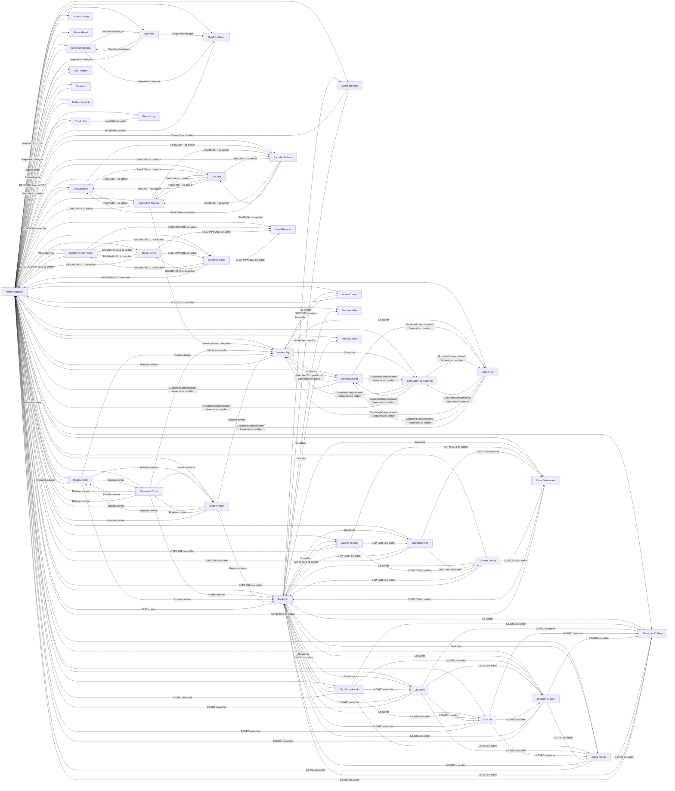

# Social Graph

## Connection Registry

| Person A | Connection | Person B | Description & Context |
|----------|-----------|----------|-----------------------|
| [[Andrej Karpathy]] | PhD advisor | [[Fei-Fei Li]] | Karpathy's primary PhD advisor at Stanford Vision Lab |
| [[Andrej Karpathy]] | Rotation advisor | [[Daphne Koller]] | First-year PhD rotation at Stanford |
| [[Andrej Karpathy]] | Rotation advisor | [[Andrew Ng]] | First-year PhD rotation at Stanford |
| [[Andrej Karpathy]] | Rotation advisor | [[Sebastian Thrun]] | First-year PhD rotation at Stanford |
| [[Andrej Karpathy]] | Rotation advisor | [[Vladlen Koltun]] | First-year PhD rotation at Stanford |
| [[Andrej Karpathy]] | MSc supervisor | [[Michiel van de Panne]] | UBC MSc advisor (2009–2011), supervised learning controllers for simulated figures |
| [[Andrej Karpathy]] | Influenced by (classes) | [[Geoffrey Hinton]] | Attended Hinton's deep learning classes and reading groups at UBC (2005–2009) |
| [[Andrej Karpathy]] | DeepMind colleague | [[Koray Kavukcuoglu]] | Karpathy's research internship at DeepMind (2015) |
| [[Andrej Karpathy]] | DeepMind colleague | [[Vlad Mnih]] | DeepMind research team (2015) |
| [[Andrej Karpathy]] | Conference appearance | [[Jensen Huang]] | NVIDIA GTC 2015 keynote appearance together |
| [[Andrej Karpathy]] | Podcast guest | [[Pieter Abbeel]] | Robot Brains Podcast (2021) |
| [[Andrej Karpathy]] | DenseCap co-author | [[Justin Johnson]] | DenseCap (CVPR 2016 Oral) and Visualizing/Understanding Recurrent Networks (ICLR 2016 Workshop) |
| [[Andrej Karpathy]] | PixelCNN++ co-author | [[Tim Salimans]] | PixelCNN++ (ICLR 2017) |
| [[Andrej Karpathy]] | PixelCNN++ co-author | [[Xi Chen]] | PixelCNN++ (ICLR 2017) |
| [[Andrej Karpathy]] | PixelCNN++ co-author | [[Diederik P. Kingma]] | PixelCNN++ (ICLR 2017) |
| [[Andrej Karpathy]] | PixelCNN++ co-author | [[Yaroslav Bulatov]] | PixelCNN++ (ICLR 2017) |
| [[Andrej Karpathy]] | Grounded Compositional Semantics co-author | [[Richard Socher]] | TACL 2013, during Karpathy's Google Research internship |
| [[Andrej Karpathy]] | Grounded Compositional Semantics co-author | [[Quoc V. Le]] | TACL 2013, during Karpathy's Google Research internship |
| [[Andrej Karpathy]] | Grounded Compositional Semantics co-author | [[Christopher D. Manning]] | TACL 2013, during Karpathy's Google Research internship |
| [[Andrej Karpathy]] | NIPS 2012 co-author | [[Adam Coates]] | "Emergence of Object-Selective Features in Unsupervised Feature Learning" |
| [[Andrej Karpathy]] | Podcast interviewee | [[Lex Fridman]] | Lex Fridman Podcast (2022) |
| [[Andrej Karpathy]] | Podcast interviewee | [[Dwarlesh]] | Podcast interview (2025) |
| [[Andrej Karpathy]] | Conference appearance | [[Nathan Benaich]] | RE·WORK Summit (2017) |
| [[Andrej Karpathy]] | NeurTalk2 co-author | [[Tianlin Shi]] | Image captioning system |
| [[Andrej Karpathy]] | NeurTalk2 co-author | [[Percy Liang]] | Image captioning system |
| [[Fei-Fei Li]] | ILSVRC co-author | [[Olga Russakovsky]] | ImageNet Large Scale Visual Recognition Challenge paper (JMLR 2015) |
| [[Fei-Fei Li]] | ILSVRC co-author | [[Jia Deng]] | ImageNet Large Scale Visual Recognition Challenge paper (JMLR 2015) |
| [[Fei-Fei Li]] | ILSVRC co-author | [[Hao Su]] | ImageNet Large Scale Visual Recognition Challenge paper (JMLR 2015) |
| [[Fei-Fei Li]] | ILSVRC co-author | [[Jonathan Krause]] | ImageNet Large Scale Visual Recognition Challenge paper (JMLR 2015) |
| [[Fei-Fei Li]] | ILSVRC co-author | [[Aditya Khosla]] | ImageNet Large Scale Visual Recognition Challenge paper (JMLR 2015) |
| [[Fei-Fei Li]] | ILSVRC co-author | [[Alexander C. Berg]] | ImageNet Large Scale Visual Recognition Challenge paper (JMLR 2015) |
| [[Fei-Fei Li]] | CVPR 2014 co-author | [[George Toderici]] | Large-Scale Video Classification with CNNs |
| [[Fei-Fei Li]] | CVPR 2014 co-author | [[Sanketh Shetty]] | Large-Scale Video Classification with CNNs |
| [[Fei-Fei Li]] | CVPR 2014 co-author | [[Thomas Leung]] | Large-Scale Video Classification with CNNs |
| [[Fei-Fei Li]] | CVPR 2014 co-author | [[Rahul Sukthankar]] | Large-Scale Video Classification with CNNs |
| [[Fei-Fei Li]] | ICRA 2013 co-author | [[Stephen Miller]] | Object Discovery in 3D Scenes via Shape Analysis |
| [[Andrew Ng]] | Adam optimizer co-creator | [[Diederik P. Kingma]] | Co-creators of the Adam optimization algorithm |
| [[Andrew Ng]] | NIPS 2012 co-author | [[Adam Coates]] | "Emergence of Object-Selective Features in Unsupervised Feature Learning" |
| [[Andrew Ng]] | Grounded Compositional Semantics co-author | [[Richard Socher]] | TACL 2013 |
| [[Andrew Ng]] | Grounded Compositional Semantics co-author | [[Quoc V. Le]] | TACL 2013 |
| [[Andrew Ng]] | Grounded Compositional Semantics co-author | [[Christopher D. Manning]] | TACL 2013 |
| [[Andrew Ng]] | Rotation advisor | [[Daphne Koller]] | Stanford rotation advising program (2011–2017) |
| [[Andrew Ng]] | Rotation advisor | [[Sebastian Thrun]] | Stanford rotation advising program (2011–2017) |
| [[Andrew Ng]] | Rotation advisor | [[Vladlen Koltun]] | Stanford rotation advising program (2011–2017) |
| [[Andrew Ng]] | Rotation advisor | [[Fei-Fei Li]] | Stanford rotation advising program (2011–2017) |
| [[DeepMind team]] | DeepMind colleague | [[Vlad Mnih]] | Deep reinforcement learning research (2015) |
| [[DeepMind team]] | DeepMind colleague | [[Koray Kavukcuoglu]] | Deep reinforcement learning research (2015) |
| [[DeepMind team]] | DeepMind colleague | [[Geoffrey Hinton]] | Deep reinforcement learning research (2015) |
| [[DeepMind team]] | DeepMind colleague | [[Andrej Karpathy]] | Research intern at DeepMind (2015) |
| [[Stanford Vision Lab]] | ILSVRC co-author | [[Olga Russakovsky]] | ImageNet Large Scale Visual Recognition Challenge paper (JMLR 2015) |
| [[Stanford Vision Lab]] | ILSVRC co-author | [[Jia Deng]] | ImageNet Large Scale Visual Recognition Challenge paper (JMLR 2015) |
| [[Stanford Vision Lab]] | ILSVRC co-author | [[Hao Su]] | ImageNet Large Scale Visual Recognition Challenge paper (JMLR 2015) |
| [[Stanford Vision Lab]] | ILSVRC co-author | [[Jonathan Krause]] | ImageNet Large Scale Visual Recognition Challenge paper (JMLR 2015) |
| [[Stanford Vision Lab]] | ILSVRC co-author | [[Aditya Khosla]] | ImageNet Large Scale Visual Recognition Challenge paper (JMLR 2015) |
| [[Stanford Vision Lab]] | ILSVRC co-author | [[Alexander C. Berg]] | ImageNet Large Scale Visual Recognition Challenge paper (JMLR 2015) |
| [[Stanford Vision Lab]] | CVPR 2014 co-author | [[George Toderici]] | Large-Scale Video Classification with CNNs |
| [[Stanford Vision Lab]] | CVPR 2014 co-author | [[Sanketh Shetty]] | Large-Scale Video Classification with CNNs |
| [[Stanford Vision Lab]] | CVPR 2014 co-author | [[Thomas Leung]] | Large-Scale Video Classification with CNNs |
| [[Stanford Vision Lab]] | CVPR 2014 co-author | [[Rahul Sukthankar]] | Large-Scale Video Classification with CNNs |
| [[UBC Robotics Group]] | SIGGRAPH 2011 co-author | [[Michiel van de Panne]] | Locomotion Skills for Simulated Quadrupeds |
| [[UBC Robotics Group]] | SIGGRAPH 2011 co-author | [[Stelian Coros]] | Locomotion Skills for Simulated Quadrupeds |
| [[UBC Robotics Group]] | SIGGRAPH 2011 co-author | [[Benjamin Jones]] | Locomotion Skills for Simulated Quadrupeds |
| [[UBC Robotics Group]] | SIGGRAPH 2011 co-author | [[Lionel Reveret]] | Locomotion Skills for Simulated Quadrupeds |
| [[UBC Robotics Group]] | SIGGRAPH 2011 co-author | [[Andrej Karpathy]] | Locomotion Skills for Simulated Quadrupeds |
| [[PixelCNN++ authors]] | ICLR 2017 co-author | [[Tim Salimans]] | PixelCNN++: A PixelCNN Implementation with Discretized Logistic Mixture Likelihood |
| [[PixelCNN++ authors]] | ICLR 2017 co-author | [[Xi Chen]] | PixelCNN++ (ICLR 2017) |
| [[PixelCNN++ authors]] | ICLR 2017 co-author | [[Diederik P. Kingma]] | PixelCNN++ (ICLR 2017) |
| [[PixelCNN++ authors]] | ICLR 2017 co-author | [[Yaroslav Bulatov]] | PixelCNN++ (ICLR 2017) |
| [[PixelCNN++ authors]] | ICLR 2017 co-author | [[Andrej Karpathy]] | PixelCNN++ (ICLR 2017) |
| [[UBC Robotics Group]] | SIGGRAPH 2011 co-author | [[Stelian Coros]] | Locomotion Skills for Simulated Quadrupeds (SIGGRAPH 2011) |
| [[UBC Robotics Group]] | SIGGRAPH 2011 co-author | [[Benjamin Jones]] | Locomotion Skills for Simulated Quadrupeds (SIGGRAPH 2011) |
| [[UBC Robotics Group]] | SIGGRAPH 2011 co-author | [[Lionel Reveret]] | Locomotion Skills for Simulated Quadrupeds (SIGGRAPH 2011) |
| [[UBC Robotics Group]] | SIGGRAPH 2011 co-author | [[Michiel van de Panne]] | Locomotion Skills for Simulated Quadrupeds (SIGGRAPH 2011) |
| [[UBC Robotics Group]] | SIGGRAPH 2011 co-author | [[Andrej Karpathy]] | Locomotion Skills for Simulated Quadrupeds (SIGGRAPH 2011) |
| [[UBC Robotics Group]] | SIGGRAPH 2011 co-author | [[Benjamin Jones]] | Locomotion Skills for Simulated Quadrupeds (SIGGRAPH 2011) |
| [[UBC Robotics Group]] | SIGGRAPH 2011 co-author | [[Lionel Reveret]] | Locomotion Skills for Simulated Quadrupeds (SIGGRAPH 2011) |
| [[UBC Robotics Group]] | SIGGRAPH 2011 co-author | [[Michiel van de Panne]] | Locomotion Skills for Simulated Quadrupeds (SIGGRAPH 2011) |
| [[UBC Robotics Group]] | SIGGRAPH 2011 co-author | [[Stelian Coros]] | Locomotion Skills for Simulated Quadrupeds (SIGGRAPH 2011) |
| [[UBC Robotics Group]] | SIGGRAPH 2011 co-author | [[Andrej Karpathy]] | Locomotion Skills for Simulated Quadrupeds (SIGGRAPH 2011) |
| [[UBC Robotics Group]] | SIGGRAPH 2011 co-author | [[Lionel Reveret]] | Locomotion Skills for Simulated Quadrupeds (SIGGRAPH 2011) |
| [[UBC Robotics Group]] | SIGGRAPH 2011 co-author | [[Benjamin Jones]] | Locomotion Skills for Simulated Quadrupeds (SIGGRAPH 2011) |
| [[UBC Robotics Group]] | SIGGRAPH 2011 co-author | [[Michiel van de Panne]] | Locomotion Skills for Simulated Quadrupeds (SIGGRAPH 2011) |
| [[UBC Robotics Group]] | SIGGRAPH 2011 co-author | [[Stelian Coros]] | Locomotion Skills for Simulated Quadrupeds (SIGGRAPH 2011) |
| [[UBC Robotics Group]] | SIGGRAPH 2011 co-author | [[Andrej Karpathy]] | Locomotion Skills for Simulated Quadrupeds (SIGGRAPH 2011) |
| [[UBC Robotics Group]] | SIGGRAPH 2011 co-author | [[Benjamin Jones]] | Locomotion Skills for Simulated Quadrupeds (SIGGRAPH 2011) |
| [[UBC Robotics Group]] | SIGGRAPH 2011 co-author | [[Lionel Reveret]] | Locomotion Skills for Simulated Quadrupeds (SIGGRAPH 2011) |
| [[UBC Robotics Group]] | SIGGRAPH 2011 co-author | [[Stelian Coros]] | Locomotion Skills for Simulated Quadrupeds (SIGGRAPH 2011) |
| [[UBC Robotics Group]] | SIGGRAPH 2011 co-author | [[Michiel van de Panne]] | Locomotion Skills for Simulated Quadrupeds (SIGGRAPH 2011) |
| [[UBC Robotics Group]] | SIGGRAPH 2011 co-author | [[Andrej Karpathy]] | Locomotion Skills for Simulated Quadrupeds (SIGGRAPH 2011) |
