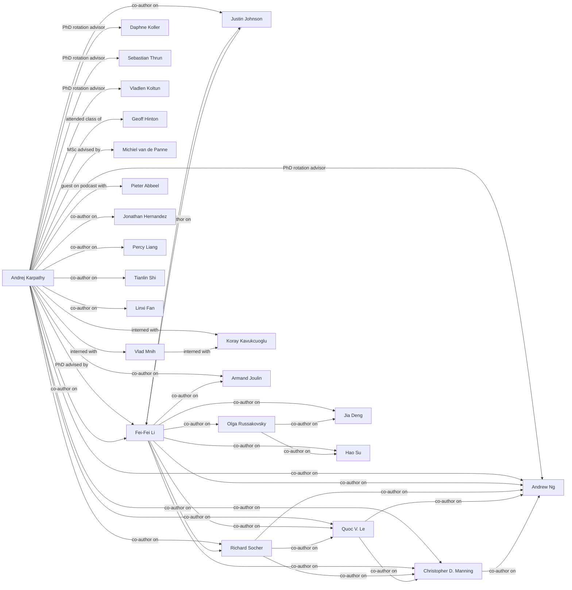

# Social Graph

A map of interpersonal connections among individuals in the LLM-Wiki vault.

## Mermaid Flowchart

## Connection Registry

| Person A | Connection | Person B | Description & Context |
|----------|-----------|----------|----------------------|
| [[Andrej Karpathy]] | PhD advised by | [[Fei-Fei Li]] | Karpathy's PhD thesis "Connecting Images and Natural Language" (2016) was advised by Fei-Fei Li at Stanford Vision Lab. ([source](wiki/summaries/Andrej_Karpathy.md)) |
| [[Andrej Karpathy]] | PhD rotation advisor | [[Daphne Koller]] | Koller was one of Karpathy's advisors during his PhD rotation program at Stanford. ([source](wiki/summaries/Andrej_Karpathy.md)) |
| [[Andrej Karpathy]] | PhD rotation advisor | [[Andrew Ng]] | Ng was one of Karpathy's advisors during his PhD rotation program at Stanford. ([source](wiki/summaries/Andrej_Karpathy.md)) |
| [[Andrej Karpathy]] | PhD rotation advisor | [[Sebastian Thrun]] | Thrun was one of Karpathy's advisors during his PhD rotation program at Stanford. ([source](wiki/summaries/Andrej_Karpathy.md)) |
| [[Andrej Karpathy]] | PhD rotation advisor | [[Vladlen Koltun]] | Koltun was one of Karpathy's advisors during his PhD rotation program at Stanford. ([source](wiki/summaries/Andrej_Karpathy.md)) |
| [[Andrej Karpathy]] | attended class of | [[Geoff Hinton]] | Karpathy attended Hinton's class and reading groups at University of Toronto during his BSc (2005-2009). ([source](wiki/summaries/Andrej_Karpathy.md)) |
| [[Andrej Karpathy]] | MSc advised by | [[Michiel van de Panne]] | Van de Panne was Karpathy's MSc advisor at UBC (2009-2011); they worked on machine learning for agile robotics. ([source](wiki/summaries/Andrej_Karpathy.md)) |
| [[Andrej Karpathy]] | interned with | [[Vlad Mnih]] | Karpathy interned at DeepMind in 2015 on the deep reinforcement learning team with Mnih. ([source](wiki/summaries/Andrej_Karpathy.md)) |
| [[Andrej Karpathy]] | interned with | [[Koray Kavukcuoglu]] | Karpathy interned at DeepMind in 2015 with Kavukcuoglu on the deep reinforcement learning team. ([source](wiki/summaries/Andrej_Karpathy.md)) |
| [[Vlad Mnih]] | interned with | [[Koray Kavukcuoglu]] | Both interned together at DeepMind in 2015 on the deep reinforcement learning team. ([source](wiki/summaries/Andrej_Karpathy.md)) |
| [[Andrej Karpathy]] | co-author on | [[Fei-Fei Li]] | Co-authored DenseCap (CVPR 2016), Visualizing Recurrent Networks (ICLR 2016), Deep Visual-Semantic Alignments (CVPR 2015), ImageNet Challenge (JCV 2015), and Deep Fragment Embeddings (NIPS 2014). ([source](wiki/summaries/Andrej_Karpathy.md)) |
| [[Fei-Fei Li]] | co-author on | [[Armand Joulin]] | Co-authored "Deep Fragment Embeddings for Bidirectional Image-Sentence Mapping" (NIPS 2014). ([source](wiki/summaries/Andrej_Karpathy.md)) |
| [[Andrej Karpathy]] | co-author on | [[Justin Johnson]] | Co-authored DenseCap (CVPR 2016), Visualizing Recurrent Networks (ICLR 2016), Deep Visual-Semantic Alignments (CVPR 2015), and NeuralTalk2. ([source](wiki/summaries/Andrej_Karpathy.md)) |
| [[Justin Johnson]] | co-author on | [[Fei-Fei Li]] | Co-authored DenseCap, Visualizing Recurrent Networks, and Deep Visual-Semantic Alignments. ([source](wiki/summaries/Andrej_Karpathy.md)) |
| [[Andrej Karpathy]] | co-author on | [[Richard Socher]] | Co-authored "Grounded Compositional Semantics for Finding and Describing Images with Sentences" (TACL 2013). ([source](wiki/summaries/Andrej_Karpathy.md)) |
| [[Richard Socher]] | co-author on | [[Quoc V. Le]] | Co-authored "Grounded Compositional Semantics" (TACL 2013) with Karpathy, Manning, and Ng. ([source](wiki/summaries/Andrej_Karpathy.md)) |
| [[Richard Socher]] | co-author on | [[Christopher D. Manning]] | Co-authored "Grounded Compositional Semantics" (TACL 2013) with Karpathy, Le, and Ng. ([source](wiki/summaries/Andrej_Karpathy.md)) |
| [[Richard Socher]] | co-author on | [[Andrew Ng]] | Co-authored "Grounded Compositional Semantics" (TACL 2013) with Karpathy, Le, and Manning. ([source](wiki/summaries/Andrej_Karpathy.md)) |
| [[Quoc V. Le]] | co-author on | [[Christopher D. Manning]] | Co-authored "Grounded Compositional Semantics" (TACL 2013) with Karpathy, Socher, and Ng. ([source](wiki/summaries/Andrej_Karpathy.md)) |
| [[Quoc V. Le]] | co-author on | [[Andrew Ng]] | Co-authored "Grounded Compositional Semantics" (TACL 2013) with Karpathy, Socher, and Manning. ([source](wiki/summaries/Andrej_Karpathy.md)) |
| [[Christopher D. Manning]] | co-author on | [[Andrew Ng]] | Co-authored "Grounded Compositional Semantics" (TACL 2013) with Karpathy, Socher, and Le. ([source](wiki/summaries/Andrej_Karpathy.md)) |
| [[Andrej Karpathy]] | co-author on | [[Andrew Ng]] | Co-authored "Grounded Compositional Semantics" (TACL 2013). ([source](wiki/summaries/Andrej_Karpathy.md)) |
| [[Andrej Karpathy]] | co-author on | [[Tianlin Shi]] | Co-authored "World of Bits" (ICML 2017) with Fan, Hernandez, and Liang. ([source](wiki/summaries/Andrej_Karpathy.md)) |
| [[Tianlin Shi]] | co-author on | [[Linxi Fan]] | Co-authored "World of Bits" (ICML 2017) with Karpathy, Hernandez, and Liang. ([source](wiki/summaries/Andrej_Karpathy.md)) |
| [[Linxi Fan]] | co-author on | [[Jonathan Hernandez]] | Co-authored "World of Bits" (ICML 2017) with Karpathy, Shi, and Liang. ([source](wiki/summaries/Andrej_Karpathy.md)) |
| [[Jonathan Hernandez]] | co-author on | [[Percy Liang]] | Co-authored "World of Bits" (ICML 2017) with Karpathy, Shi, and Fan. ([source](wiki/summaries/Andrej_Karpathy.md)) |
| [[Percy Liang]] | co-author on | [[Tianlin Shi]] | Co-authored "World of Bits" (ICML 2017) with Karpathy, Fan, and Hernandez. ([source](wiki/summaries/Andrej_Karpathy.md)) |
| [[Olga Russakovsky]] | co-author on | [[Jia Deng]] | Co-authored the ImageNet Large Scale Visual Recognition Challenge paper (JCV 2015). ([source](wiki/summaries/Andrej_Karpathy.md)) |
| [[Olga Russakovsky]] | co-author on | [[Hao Su]] | Co-authored the ImageNet Large Scale Visual Recognition Challenge paper (JCV 2015). ([source](wiki/summaries/Andrej_Karpathy.md)) |
| [[Jia Deng]] | co-author on | [[Hao Su]] | Co-authored the ImageNet Large Scale Visual Recognition Challenge paper (JCV 2015). ([source](wiki/summaries/Andrej_Karpathy.md)) |
| [[Andrej Karpathy]] | guest on podcast with | [[Pieter Abbeel]] | Appeared on the Robot Brains podcast with Abbeel in 2021. ([source](wiki/summaries/Andrej_Karpathy.md)) |
