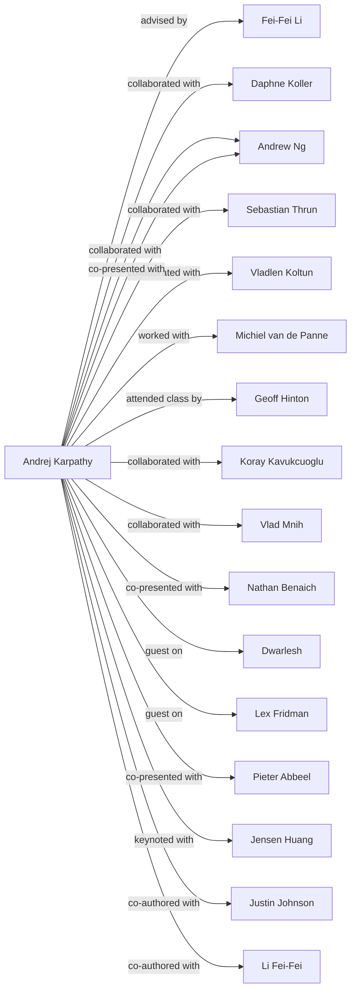

# Social Graph

## Connection Map

## Relationship Registry

| Person A | Connection | Person B | Context / Source |
| :--- | :--- | :--- | :--- |
| [[Andrej Karpathy]] | advised by | [[Fei-Fei Li]] | [[Andrej Karpathy Bio and Portfolio]] |
| [[Andrej Karpathy]] | collaborated with | [[Daphne Koller]] | [[Andrej Karpathy Bio and Portfolio]] |
| [[Andrej Karpathy]] | collaborated with | [[Andrew Ng]] | [[Andrej Karpathy Bio and Portfolio]] |
| [[Andrej Karpathy]] | collaborated with | [[Sebastian Thrun]] | [[Andrej Karpathy Bio and Portfolio]] |
| [[Andrej Karpathy]] | collaborated with | [[Vladlen Koltun]] | [[Andrej Karpathy Bio and Portfolio]] |
| [[Andrej Karpathy]] | worked with | [[Michiel van de Panne]] | [[Andrej Karpathy Bio and Portfolio]] |
| [[Andrej Karpathy]] | attended class by | [[Geoff Hinton]] | [[Andrej Karpathy Bio and Portfolio]] |
| [[Andrej Karpathy]] | collaborated with | [[Koray Kavukcuoglu]] | [[Andrej Karpathy Bio and Portfolio]] |
| [[Andrej Karpathy]] | collaborated with | [[Vlad Mnih]] | [[Andrej Karpathy Bio and Portfolio]] |
| [[Andrej Karpathy]] | co-presented with | [[Andrew Ng]] | [[Andrej Karpathy Bio and Portfolio]] |
| [[Andrej Karpathy]] | co-presented with | [[Nathan Benaich]] | [[Andrej Karpathy Bio and Portfolio]] |
| [[Andrej Karpathy]] | guest on | [[Dwarlesh]] | [[Andrej Karpathy Bio and Portfolio]] |
| [[Andrej Karpathy]] | guest on | [[Lex Fridman]] | [[Andrej Karpathy Bio and Portfolio]] |
| [[Andrej Karpathy]] | co-presented with | [[Pieter Abbeel]] | [[Andrej Karpathy Bio and Portfolio]] |
| [[Andrej Karpathy]] | keynoted with | [[Jensen Huang]] | [[Andrej Karpathy Bio and Portfolio]] |
| [[Andrej Karpathy]] | co-authored with | [[Justin Johnson]] | [[Andrej Karpathy Bio and Portfolio]] |
| [[Andrej Karpathy]] | co-authored with | [[Li Fei-Fei]] | [[Andrej Karpathy Bio and Portfolio]] |
