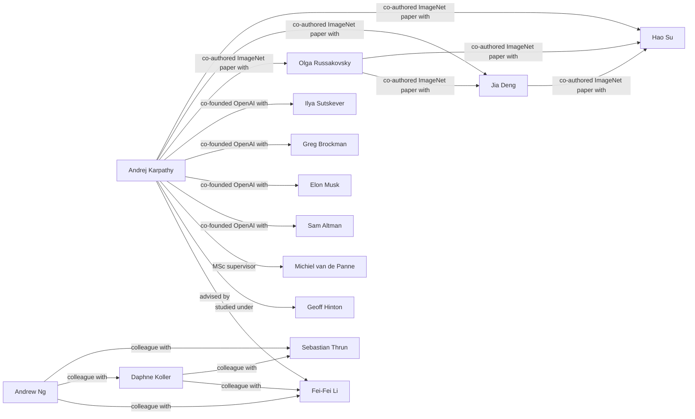

# Social Graph

Interactive social graph and detailed connection map of the individuals in this vault.

## Connection Registry

| Person A | Connection | Person B | Description & Context |
|---|---|---|---|
| [[Andrej Karpathy]] | advised by | [[Fei-Fei Li]] | Karpathy's PhD advisor at Stanford (2011–2016), where his research focused on convolutional and recurrent neural networks applied to computer vision and natural language processing. ([Andrej_Karpathy.md](assets/2026-06-20/Andrej_Karpathy.md)) |
| [[Andrej Karpathy]] | studied under | [[Geoff Hinton]] | Karpathy attended Hinton's classes and reading groups at the University of Toronto during his BSc (2005–2009), which is where he first became interested in deep learning. ([Andrej_Karpathy.md](assets/2026-06-20/Andrej_Karpathy.md)) |
| [[Andrej Karpathy]] | MSc supervisor | [[Michiel van de Panne]] | Karpathy worked with van de Panne on learning controllers for physically-simulated figures during his MSc at the University of British Columbia (2009–2011). ([Andrej_Karpathy.md](assets/2026-06-20/Andrej_Karpathy.md)) |
| [[Andrej Karpathy]] | co-founded OpenAI with | [[Sam Altman]] | Both were founding members of OpenAI when it was established as a non-profit in December 2015. ([Andrej_Karpathy.md](assets/2026-06-20/Andrej_Karpathy.md)) |
| [[Andrej Karpathy]] | co-founded OpenAI with | [[Elon Musk]] | Both were founding members of OpenAI when it was established as a non-profit in December 2015. ([Andrej_Karpathy.md](assets/2026-06-20/Andrej_Karpathy.md)) |
| [[Andrej Karpathy]] | co-founded OpenAI with | [[Greg Brockman]] | Both were founding members of OpenAI when it was established as a non-profit in December 2015. ([Andrej_Karpathy.md](assets/2026-06-20/Andrej_Karpathy.md)) |
| [[Andrej Karpathy]] | co-founded OpenAI with | [[Ilya Sutskever]] | Both were founding members of OpenAI when it was established as a non-profit in December 2015. ([Andrej_Karpathy.md](assets/2026-06-20/Andrej_Karpathy.md)) |
| [[Andrej Karpathy]] | co-authored ImageNet paper with | [[Olga Russakovsky]] | Co-authors of the ImageNet Large Scale Visual Recognition Challenge paper published in JCV 2015. ([Andrej_Karpathy.md](assets/2026-06-20/Andrej_Karpathy.md)) |
| [[Andrej Karpathy]] | co-authored ImageNet paper with | [[Jia Deng]] | Co-authors of the ImageNet Large Scale Visual Recognition Challenge paper published in JCV 2015. ([Andrej_Karpathy.md](assets/2026-06-20/Andrej_Karpathy.md)) |
| [[Andrej Karpathy]] | co-authored ImageNet paper with | [[Hao Su]] | Co-authors of the ImageNet Large Scale Visual Recognition Challenge paper published in JCV 2015. ([Andrej_Karpathy.md](assets/2026-06-20/Andrej_Karpathy.md)) |
| [[Andrew Ng]] | colleague with | [[Fei-Fei Li]] | Both were faculty members at Stanford University in the AI community. ([Andrej_Karpathy.md](assets/2026-06-20/Andrej_Karpathy.md)) |
| [[Andrew Ng]] | colleague with | [[Daphne Koller]] | Both were faculty members at Stanford University in the AI community. ([Andrej_Karpathy.md](assets/2026-06-20/Andrej_Karpathy.md)) |
| [[Andrew Ng]] | colleague with | [[Sebastian Thrun]] | Both were faculty members at Stanford University in the AI community. ([Andrej_Karpathy.md](assets/2026-06-20/Andrej_Karpathy.md)) |
| [[Daphne Koller]] | colleague with | [[Fei-Fei Li]] | Both were faculty members at Stanford University in the AI community. ([Andrej_Karpathy.md](assets/2026-06-20/Andrej_Karpathy.md)) |
| [[Daphne Koller]] | colleague with | [[Sebastian Thrun]] | Both were faculty members at Stanford University in the AI community. ([Andrej_Karpathy.md](assets/2026-06-20/Andrej_Karpathy.md)) |
| [[Sebastian Thrun]] | colleague with | [[Fei-Fei Li]] | Both were faculty members at Stanford University in the AI community. ([Andrej_Karpathy.md](assets/2026-06-20/Andrej_Karpathy.md)) |
| [[Olga Russakovsky]] | co-authored ImageNet paper with | [[Jia Deng]] | Co-authors of the ImageNet Large Scale Visual Recognition Challenge paper published in JCV 2015. ([Andrej_Karpathy.md](assets/2026-06-20/Andrej_Karpathy.md)) |
| [[Olga Russakovsky]] | co-authored ImageNet paper with | [[Hao Su]] | Co-authors of the ImageNet Large Scale Visual Recognition Challenge paper published in JCV 2015. ([Andrej_Karpathy.md](assets/2026-06-20/Andrej_Karpathy.md)) |
| [[Jia Deng]] | co-authored ImageNet paper with | [[Hao Su]] | Co-authors of the ImageNet Large Scale Visual Recognition Challenge paper published in JCV 2015. ([Andrej_Karpathy.md](assets/2026-06-20/Andrej_Karpathy.md)) |
