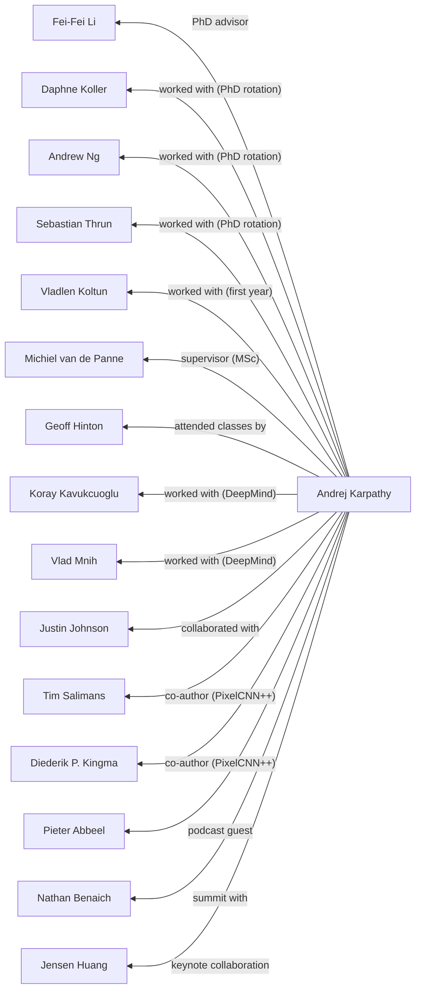

# Social Graph

## Connection Map

## Connection Registry

| Person A | Connection | Person B | Description & Context |
|----------|-----------|----------|----------------------|
| [[Andrej Karpathy]] | PhD advisor | [[Fei-Fei Li]] | Fei-Fei Li was Andrej Karpathy's PhD advisor at Stanford Vision Lab. ([source](assets/2026-06-09/Andrej_Karpathy.md)) |
| [[Andrej Karpathy]] | worked with (PhD rotation) | [[Daphne Koller]] | Worked with Daphne Koller during PhD rotation program at Stanford. ([source](assets/2026-06-09/Andrej_Karpathy.md)) |
| [[Andrej Karpathy]] | worked with (PhD rotation) | [[Andrew Ng]] | Worked with Andrew Ng during PhD rotation program at Stanford. ([source](assets/2026-06-09/Andrej_Karpathy.md)) |
| [[Andrej Karpathy]] | worked with (PhD rotation) | [[Sebastian Thrun]] | Worked with Sebastian Thrun during PhD rotation program at Stanford. ([source](assets/2026-06-09/Andrej_Karpathy.md)) |
| [[Andrej Karpathy]] | worked with (first year) | [[Vladlen Koltun]] | Worked with Vladlen Koltun during first year rotation at Stanford. ([source](assets/2026-06-09/Andrej_Karpathy.md)) |
| [[Andrej Karpathy]] | supervisor (MSc) | [[Michiel van de Panne]] | Michiel van de Panne supervised Andrej Karpathy's MSc work at University of British Columbia on learning controllers for physically-simulated figures. ([source](assets/2026-06-09/Andrej_Karpathy.md)) |
| [[Andrej Karpathy]] | attended classes by | [[Geoff Hinton]] | Attended Geoff Hinton's class and reading groups at University of Toronto, which sparked Andrej Karpathy's early interest in deep learning. ([source](assets/2026-06-09/Andrej_Karpathy.md)) |
| [[Andrej Karpathy]] | worked with (DeepMind) | [[Koray Kavukcuoglu]] | Worked with Koray Kavukcuoglu at DeepMind in 2015 on deep reinforcement learning. ([source](assets/2026-06-09/Andrej_Karpathy.md)) |
| [[Andrej Karpathy]] | worked with (DeepMind) | [[Vlad Mnih]] | Worked with Vlad Mnih at DeepMind on deep reinforcement learning. ([source](assets/2026-06-09/Andrej_Karpathy.md)) |
| [[Andrej Karpathy]] | collaborated with | [[Justin Johnson]] | Collaborated with Justin Johnson on dense captioning work (DenseCap). ([source](assets/2026-06-09/Andrej_Karpathy.md)) |
| [[Andrej Karpathy]] | co-author (PixelCNN++) | [[Tim Salimans]] | Co-authored PixelCNN++ paper (ICLR 2017). ([source](assets/2026-06-09/Andrej_Karpathy.md)) |
| [[Andrej Karpathy]] | co-author (PixelCNN++) | [[Diederik P. Kingma]] | Co-authored PixelCNN++ paper (ICLR 2017). ([source](assets/2026-06-09/Andrej_Karpathy.md)) |
| [[Andrej Karpathy]] | podcast guest | [[Pieter Abbeel]] | Guest on Robot Brains podcast with Pieter Abbeel (2021). ([source](assets/2026-06-09/Andrej_Karpathy.md)) |
| [[Andrej Karpathy]] | summit with | [[Nathan Benaich]] | Presented at 2017 RE·WORK Summit with Nathan Benaich. ([source](assets/2026-06-09/Andrej_Karpathy.md)) |
| [[Andrej Karpathy]] | keynote collaboration | [[Jensen Huang]] | NVIDIA GTC Keynote collaboration with Jensen Huang (2015). ([source](assets/2026-06-09/Andrej_Karpathy.md)) |
| [[Andrej Karpathy]] | founding member / returning lead | [[OpenAI]] | Founding member of OpenAI (2015), returned in 2025 to build team for midtraining and synthetic data generation. ([source](assets/2026-06-09/Andrej_Karpathy.md)) |
| [[Andrej Karpathy]] | Director of AI | [[Tesla]] | Director of AI at Tesla (2017+), led computer vision team for Autopilot and Tesla Optimus. ([source](assets/2026-06-09/Andrej_Karpathy.md)) |
