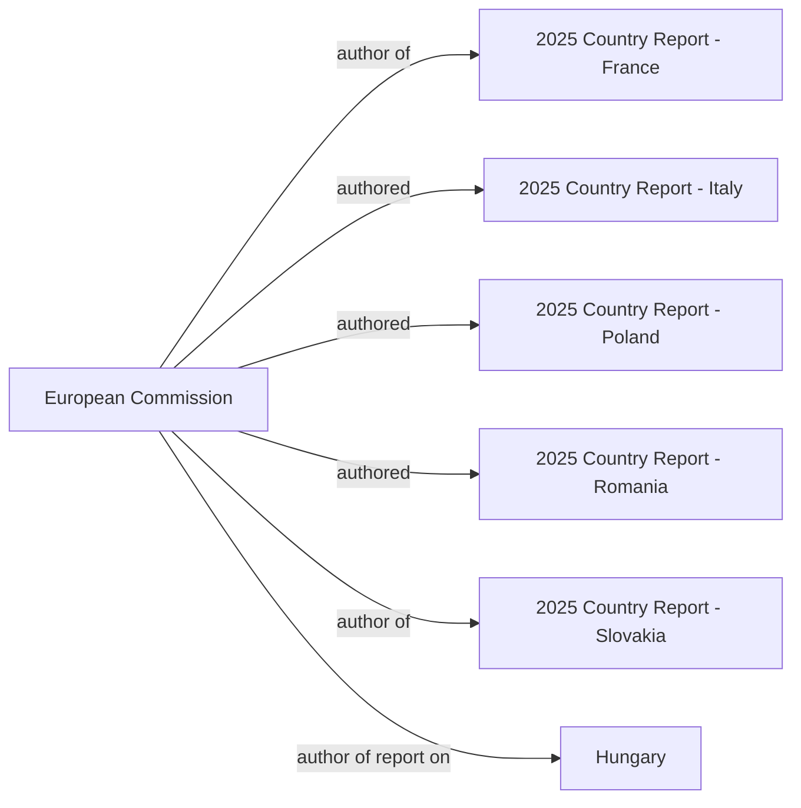

# Social Graph

## Connection Map

## Relationship Registry

| Person A | Connection | Person B | Context / Source |
| :--- | :--- | :--- | :--- |
| [[European Commission]] | author of | [[2025 Country Report - France]] | [[2025 Country Report - France]] |
| [[European Commission]] | authored | [[2025 Country Report - Italy]] | [[2025 Country Report - Italy]] |
| [[European Commission]] | authored | [[2025 Country Report - Poland]] | [[2025 Country Report - Poland]] |
| [[European Commission]] | authored | [[2025 Country Report - Romania]] | [[2025 Country Report - Romania]] |
| [[European Commission]] | author of | [[2025 Country Report - Slovakia]] | [[2025 Country Report - Slovakia]] |
| [[European Commission]] | author of report on | [[Hungary]] | [[EU Commission (2025) 2025 Country Report - Hungary]] |
