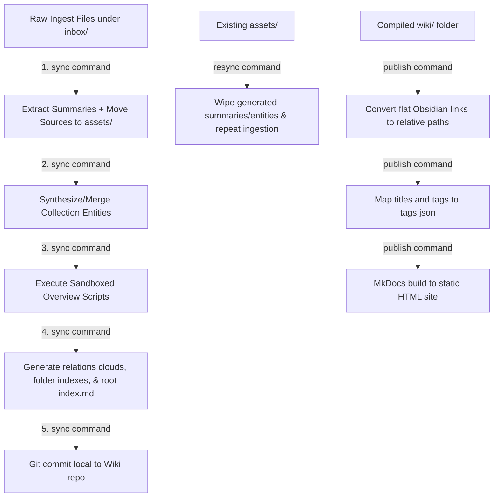

# Pipeline Architecture & Repository Layout 🗺️

This document details the compile-time execution graph, target vault layout structure, environment managers, and testing practices.

---

## 🗺️ Pipeline Execution Graph

The compilation cycle parses source markdown files and builds structured entity files sequentially:



---

## 📂 Directory Layout map

Initializing a wiki creates the following structured layout. This divides configurations, schemas, and processed cards:

```
Vaults/<WikiName>/
├── inbox/                        # Input folder for raw markdown, PDFs, or articles
├── config/
│   ├── mkdocs.yml                # Settings for MkDocs static site generation
│   └── summary/
│       ├── prompt.md             # Ingestion prompt template for LLM summarization
│       └── schema.md             # Property definitions for summary notes
├── plugins/
│   ├── collections/              # Custom collection schemas and prompt compilers
│   │   ├── concepts/
│   │   ├── persons/
│   │   └── times/
│   └── overviews/                # Script VM pipelines compiling dashboard files
│       ├── social-graph.js
│       └── timeline.js
└── wiki/                         # Output target (Obsidian workspace)
    ├── index.md                  # Map of Content root page
    ├── assets/                   # Ingested raw files archived by YYYY-MM-DD
    ├── summaries/                # Dynamic summary cards from sources
    ├── collections/              # Compiled directories (concepts/, persons/, times/)
    └── overviews/                # Generated dashboard pages (timeline.md, social-graph.md)
```

---

## ⚙️ Environment and Runtime Manager

We utilize [mise](https://mise.jdx.dev/) to ensure pinned, reproducible Node.js and Python environments across environments:

- **Node.js**: `25.9.0`
- **Python**: `3.11.15` (bound to an isolated `.venv/` virtual environment).

Runtimes should be executed using the mise prefix to align context maps:
```bash
# Run the local cli binary
mise exec -- npm run cli <command>

# Run python pipelines
mise exec -- python script.py
```

---

## 🧪 Testing

The test suite runs on [Vitest](https://vitest.dev/) to mock and validate compile sequences:
- Covers full command suites (`init`, `sync`, `resync`, `publish`).
- Asserts that file creations, schema changes, and sandboxed overview script completions behave exactly as expected.

```bash
# Run Vitest test suite
mise exec -- npm run test
```
