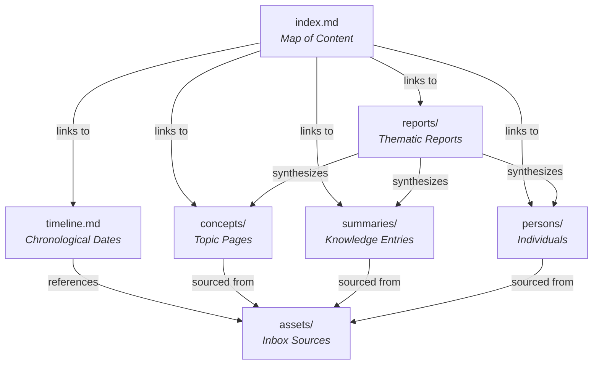
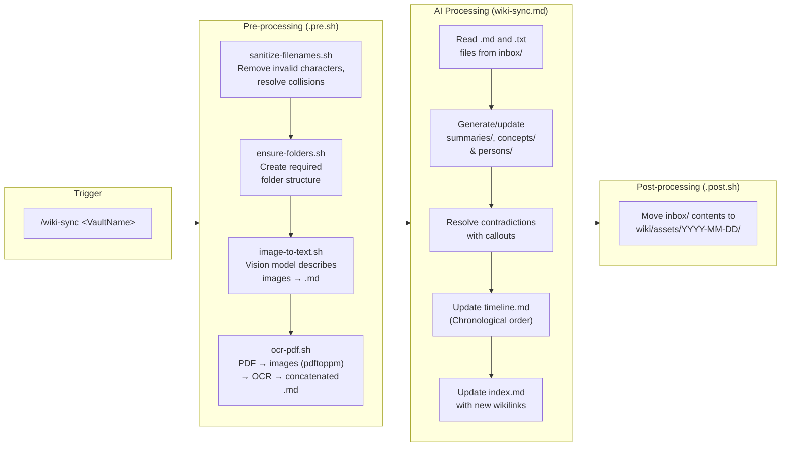
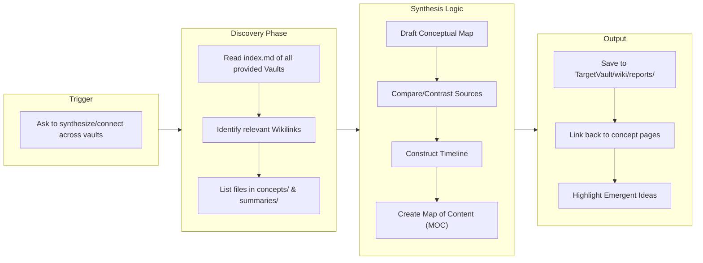

# Building MindVault: A Local, Multi-Vault LLM Engine for Obsidian

The initial spark for MindVault came directly from reading about [Andrej Karpathy's LLM Wiki](https://gist.github.com/karpathy/442a6bf555914893e9891c11519de94f). The idea of a personal knowledge base curated and managed by a large language model is incredibly compelling. But I wanted to take it further. I wanted a system that was fully offline, capable of handling multiple distinct vaults, and deeply integrated with Obsidian.

The result is MindVault: a local wiki engine powered by open-weight models running on oMLX. It processes raw files—PDFs, images, text notes—and structures them into a heavily interlinked Obsidian knowledge graph.

## The Architecture of a Multi-Vault System

MindVault organizes data into isolated "Vaults". Each vault has an `inbox/` for dropping raw files and a `wiki/` directory that serves as the actual Obsidian vault.

Inside the wiki, the LLM maps information into specific directories: `concepts/` for topics, `persons/` for individuals, and `summaries/` for digested knowledge entries. It also maintains a master `index.md` (Map of Content) and a chronological `timeline.md`.

## The Engine: Commands and Skills

Interaction with the AI happens through two channels:

1. **Commands**: Explicit slash-commands (e.g., `/wiki-sync <VaultName>`) that trigger rigid, predefined workflows.
2. **Skills**: Implicit triggers that activate when you ask a question. For example, the Wiki Q&A skill uses retrieval-augmented generation to answer queries based on your vault content, automatically citing its sources.

### The Ingestion Pipeline (`/wiki-sync`)

The core of the system is the `/wiki-sync` command. Dropping files into a vault's inbox and running this command kicks off a three-phase pipeline.

First, shell scripts sanitize the filenames, run OCR on PDFs using `pdftoppm` and DeepSeek-OCR-2, and extract semantic descriptions from images using Gemma-4-31B-IT.

Next, the AI (powered by Qwen3.6-35B) reads the text. It extracts entities, updates the chronological timeline, and resolves contradictions using Obsidian callouts. It attributes every claim back to the source file.

Finally, a post-processing script archives the original inbox files into a date-stamped assets folder, keeping the workspace clean.

### Cross-Vault Synthesis (`/wiki-report`)

While keeping vaults isolated is useful for organization, you sometimes need to connect the dots. The `/wiki-report` command spans multiple vaults to synthesize themes.

It reads the indexes of the provided vaults, compares sources, constructs a unified timeline, and outputs a Map of Content to a target vault. Every generated paragraph is forced to link back to at least two existing wiki concept pages, highlighting emergent ideas.

## Bridging the Gap: The Command Hooks Plugin

One of the more interesting technical challenges was orchestrating standard shell utilities alongside LLM processing. LLMs are great at text extraction, but terrible at driving `pdftoppm` or managing file system moves.

To solve this, MindVault uses a custom plugin system (`.opencode/plugins/commandHooks.ts`). This TypeScript plugin listens to the lifecycle events of the agent. When you type `/wiki-sync`, the plugin intercepts the `command.execute.before` event and automatically runs `wiki-sync.pre.sh`. This shell script does all the heavy lifting for OCR and image processing. Once the shell script exits successfully, the LLM takes over to process the resulting markdown. After the LLM finishes, the `command.executed` event fires, triggering `wiki-sync.post.sh` to move the files to the archive.

This hook system keeps the AI focused strictly on what it does best—reasoning about text—while traditional shell tools handle the deterministic file management and OCR conversion.

## Running Locally

Privacy is a requirement for a personal wiki. By leveraging tools like oMLX, Qwen, Gemma, and DeepSeek, MindVault ensures that not a single byte of your data leaves your machine.

The entire stack is open-source and relies on standard markdown files. If the AI processing system ever breaks, you are still left with a perfectly valid, densely linked Obsidian vault.

## What's Next

Building this system has been big-time fun, and I can't wait to finally put this setup into practice. I already have another hands-on idea for how to make the whole workflow even more productive and action-oriented.

Stay tuned!

## Acknowledgements

Thanks for additional inspiration to [Dan-Yoel Bittner](https://www.linkedin.com/in/dan-yoel-bitter-617a74157/) and [Rainer Kruschwitz](https://www.linkedin.com/in/kruschwitz/).
